# The Soliton Wake: Exploring RBH-1 as a Temporal Topology Candidate
**Matthew Lukin Smawfield**
Version: v0.4 (Blantyre)
First published: 28 December 2025 · Last updated: 13 September 2026
DOI: 10.5281/zenodo.18059250
Paper: 7 (TEP Series)

---

## Abstract
The runaway supermassive black hole RBH-1 ($z \approx 0.96$) presents a thermal paradox: JWST spectroscopy resolves a 650 km/s position–velocity span across approximately 1 kpc in a cold, star-forming system. Higher-resolution Keck/LRIS spectroscopy of the near-tip [O III] knot yields a narrow intrinsic dispersion ($\sigma \approx 31 \pm 4$ km/s), far below the $\sigma \sim 80$–85 km/s expected if that emitting component were predominantly at $T \sim 10^7$ K. Standard shock physics predicts post-shock temperatures $T \sim 10^7$ K, yielding a cooling time that exceeds the dynamical time by a factor of ~30. Yet the wake exhibits immediate star formation and extreme collimation (50:1 aspect ratio over 62 kpc).
RBH-1 is explored as a candidate Temporal Topology soliton/wake interpretation: a coherent region of altered proper-time rate whose Temporal Shear supplies a conservative body force. The corpus-wide endpoint theorem excludes the former assignment of the full velocity span to an apparent conformal redshift: $|\Delta\ln A| \simeq \Delta v/c \simeq 2.2\times10^{-3}$ would accelerate universally coupled gas to approximately $1.97\times10^4$ km/s. The dynamically consistent assignment instead treats the resolved span as coherent matter motion and applies the work integral in the profile frame. It requires a depth of order $10^{-6}$: $2.35\times10^{-6}$ for the stated rest-entry normalization and $4.55\times10^{-6}$ for a collinear benchmark using the published 954 km/s pattern speed. Either value is hundreds of times shallower than the excluded endpoint assignment and permits a small local dispersion when the shear is spatially coherent. The same scalar sector enhances the effective gravitational coupling behind the front, reducing the effective Jeans mass without identifying the resolved bulk velocity span with microscopic thermal motion.
The characteristic temporal scale $R_T$, calibrated from terrestrial GNSS correlations (Smawfield 2025g), is applied as a consistency check rather than as proof that RBH-1 is a soliton. For RBH-1 ($M \approx 2 \times 10^7 M_\odot$), the calibration yields $R_T \approx 7.8 \times 10^7$ km $\approx 1.3 R_S$ — a crossover-mass coincidence internal to the theory, since $R_T$ lies $\sim 8.6$ orders of magnitude below the resolved scale; the observed $\sim$kpc kinematic onset is carried separately by the transition-radius parametrization $R_{\rm trans} = \xi R_T$ with measured $\xi \approx 4\times10^{8}$. The amplitude of the observed kinematic discontinuity depends on screening/transition physics (via $\alpha_{\rm RBH,eff}$ at $R_{\rm trans}$) and is treated as an empirical constraint rather than an independent prediction. Specific falsification criteria are outlined; decisive discrimination awaits line-profile decomposition and X-ray flux limits.
*Keywords:* black holes: individual (RBH-1) – dark matter – gravitation – scalar fields – temporal equivalence principle

## 1. Introduction: The RBH-1 Anomaly

*Note:* This paper does not calibrate TEP and is not part of the primary evidence chain. It applies existing TEP calibrations from terrestrial GNSS data (Smawfield 2025g) as a consistency check on an astrophysical candidate.

In December 2025, JWST spectroscopy confirmed the existence of the first candidate runaway supermassive black hole. Designated RBH-1, this object has an inferred mass of approximately $10^7 M_\odot$ and a proper motion of $v_{\bullet} = 954^{+110}_{-126}$ km/s, leaving behind a 62 kpc linear feature of active star formation. The discovery is consistent with theoretical predictions that supermassive black holes can be ejected from their host galaxies via gravitational wave recoil following a black hole merger (van Dokkum et al. 2025; Campanelli et al. 2007).

At $z \approx 0.96$, RBH-1 appears as a luminous streak extending from the galaxy RCP 28 in the constellation Sextans. A bow-shaped interaction region marks its leading edge, while the wake exhibits active star formation along its entire extent.

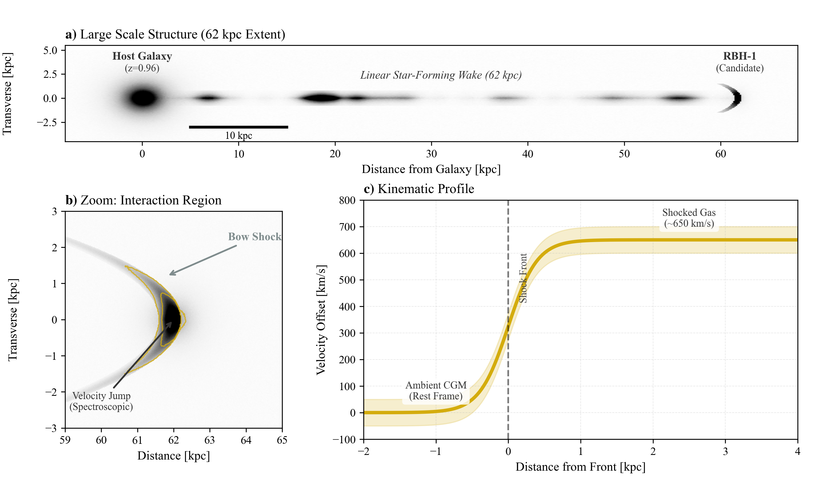
Figure 1: RBH-1 Observation. The linear wake extending from the host galaxy (RCP 28), with the bow-shock candidate at the tip. (Image adapted from van Dokkum et al. 2023).

## The Observational Puzzle

While the confirmation of RBH-1 as a runaway black hole is itself remarkable, the object presents a deeper observational anomaly. It appears as a linear streak of light extending 62 kpc ($\sim$200,000 light-years) from a distant galaxy ($z\approx 0.96$). At its tip lies a bright, bow-shaped interaction region where JWST spectroscopy reveals a sharp kinematic discontinuity: a line-of-sight velocity change of order $\sim 600$–$650$ km/s across $\sim$1 kpc (van Dokkum et al. 2023; van Dokkum et al. 2025).

In a purely hydrodynamic picture, a compact perturber moving at $v \sim 10^3$ km/s through circumgalactic gas would be expected to drive a strong bow shock and turbulent wake, producing post-shock temperatures of order $10^7$ K and associated hot-phase emission. RBH-1 instead exhibits a narrow, structurally coherent wake whose line diagnostics are consistent with gas cool enough to support ongoing star formation. This creates a fundamental quantitative tension.

## Empirical constraints (primary measurements)

### Table 1: Fiducial Parameters and Assumptions

| Parameter | Value | Source | Role in Analysis |
| --- | --- | --- | --- |
| RBH-1 Mass ($M_{\bullet}$) | $\sim 2 \times 10^7 M_{\odot}$ | van Dokkum et al. (2025) | Sets temporal scale |
| Wake Velocity ($v_{\text{wake}}$) | $954^{+110}_{-126}$ km/s | van Dokkum et al. (2025) | Defines shock Mach number |
| Velocity Jump ($\Delta v_{\text{obs}}$) | $\sim 600$ km/s | JWST NIRSpec | Primary observable to explain |
| Wake Radius ($R_{\text{wake}}$) | $\sim 0.7$ kpc | HST WFC3/UVIS | Constrains dynamical time |
| Ambient Density ($n_{\text{CGM}}$) | $10^{-3} \text{ cm}^{-3}$ | Standard CGM Model | Controls cooling efficiency |
| Characteristic Density ($\rho_T$) | $20 \text{ g/cm}^3$ | Paper 6 (TEP-UCD) | External Input (Fixed) |
| Critical Threshold ($t_{\text{cool}}/t_{\text{dyn}}$) | $> 1$ (Inefficient) | Radiative Physics | Criterion for "cold" wake |
*Note: All calculations assume solar metallicity and standard optically thin cooling functions unless otherwise noted.*
- Redshift and extent: $z\approx 0.96$, wake length 62 kpc (van Dokkum et al. 2023; van Dokkum et al. 2025).

- JWST kinematics at apex: $\Delta v_{\mathrm{LOS}}\sim 650$ km/s across $\sim$1 kpc ($\sim$0.10") at the tip (van Dokkum et al. 2025).

- Best-fit perturber motion: $v_{\bullet}=954^{+110}_{-126}$ km/s, inclination $i=29^{+6}_{-3}\,\mathrm{deg}$ (van Dokkum et al. 2025).

Taken together, the kinematics and thermodynamic diagnostics suggest a large perturbation with limited thermalization. The following sections frame this tension through two related problems: the Temperature Paradox and the Geometry Problem.

## The Cooling Bottleneck

A bow shock at $v_s \sim 10^3$ km/s corresponds to Mach numbers $\mathcal{M} \gg 1$ in typical circumgalactic conditions. Standard Rankine–Hugoniot jump conditions mandate substantial conversion of bulk kinetic energy into thermal energy. For $v_s \approx 1000$ km/s, the characteristic post-shock temperature is:
\begin{equation} \label{eq:shock_temp} T_s \approx \frac{3}{16k_B} \mu m_p v_s^2 \approx 1.4 \times 10^7 \text{ K} \end{equation}

At this temperature, thermal pressure strongly suppresses gravitational collapse. Since the Jeans mass scales as $M_J \propto T^{3/2}$, raising the temperature from $100$ K to $10^7$ K increases the characteristic collapse mass scale by a factor of $10^{7.5}$ ($\sim 3\times 10^7$), making in-situ star formation in recently shocked gas difficult without highly efficient cooling.

### The Cooling Bottleneck ($t_{\mathrm{cool}} \gg t_{\mathrm{dyn}}$)

The standard resolution invokes rapid radiative cooling, potentially aided by turbulent mixing or thermal instabilities (e.g., Gronke & Oh 2018). However, the viability of this mechanism is quantitatively constrained by the cooling physics. The following calculation demonstrates that under fiducial CGM conditions and standard optically thin cooling, the thermal model faces a fundamental timescale crisis.

#### Bremsstrahlung Cooling Time

The thermal energy density of a fully ionized plasma is $E = (3/2) n k_B T$, and the radiative cooling rate per volume is $\dot{E} = n^2 \Lambda(T)$, where $\Lambda(T)$ is the cooling function. At $T \sim 10^7$ K, cooling is dominated by free-free (Bremsstrahlung) emission with contributions from metal-line cooling, yielding $\Lambda(T) \approx 2.5 \times 10^{-23}$ erg cm$^3$ s$^{-1}$ for solar metallicity (Sutherland & Dopita 1993). The cooling time is:
\begin{equation} \label{eq:cooling_time} t_{\mathrm{cool}} = \frac{E}{\dot{E}} = \frac{3 k_B T}{2 n \Lambda(T)} \end{equation}

Substituting the post-shock temperature $T = 1.4 \times 10^7$ K and a post-shock density $n = 0.1$ cm$^{-3}$ (this high value is adopted as a conservative upper bound for a compressed/clumpy phase, distinct from the ambient CGM mean $n_{\rm CGM} \sim 10^{-3}$ cm$^{-3}$; note that since $t_{\rm cool} \propto 1/n$, lower densities would yield even longer cooling times):
\begin{equation} \label{eq:cooling_time_value} t_{\mathrm{cool}} = \frac{3 \times (1.38 \times 10^{-16}\,\mathrm{erg\,K^{-1}}) \times (1.4 \times 10^7\,\mathrm{K})}{2 \times (0.1\,\mathrm{cm^{-3}}) \times (2.5 \times 10^{-23}\,\mathrm{erg\,cm^3\,s^{-1}})} \approx 36\,\mathrm{Myr} \end{equation}

#### Dynamical Timescale

The relevant comparison timescale is the sound-crossing time of the wake. The post-shock sound speed for a fully ionized plasma ($\gamma = 5/3$, mean molecular weight $\mu = 0.6$) at $T = 1.4 \times 10^7$ K is:
\begin{equation} \label{eq:sound_speed} c_s = \sqrt{\frac{\gamma k_B T}{\mu m_p}} \approx 560\,\mathrm{km\,s^{-1}} \end{equation}

For the observed wake radius $w \approx 0.7$ kpc (van Dokkum et al. 2025), the dynamical timescale is:
\begin{equation} \label{eq:dyn_time} t_{\mathrm{dyn}} = \frac{w}{c_s} \approx 1.2\,\mathrm{Myr} \end{equation}

#### The Critical Inequality

Comparing these timescales yields the fundamental constraint:
\begin{equation} \label{eq:cool_dyn_ratio} \frac{t_{\mathrm{cool}}}{t_{\mathrm{dyn}}} = \frac{36\,\mathrm{Myr}}{1.2\,\mathrm{Myr}} \approx 30 \end{equation}
\begin{equation} \label{eq:cooling_inequality} t_{\mathrm{cool}} \gg t_{\mathrm{dyn}} \quad (\text{by a factor of } \sim 30) \end{equation}
This inequality is robust across the plausible parameter space. Sensitivity analysis shows that only at densities $n \gtrsim 1$ cm$^{-3}$ (an order of magnitude higher than typical circumgalactic values) does the ratio approach unity. While dust-gas collisional cooling can shorten timescales in some environments, high-velocity shocks ($v \sim 1000$ km/s) efficiently destroy dust grains via sputtering (Draine & Salpeter 1979), reducing the efficacy of this pathway in the immediate post-shock region. For fiducial parameters, shock-heated gas at $10^7$ K would expand and rarefy long before radiating sufficient energy to reach star-forming temperatures ($T \lesssim 10^4$ K).

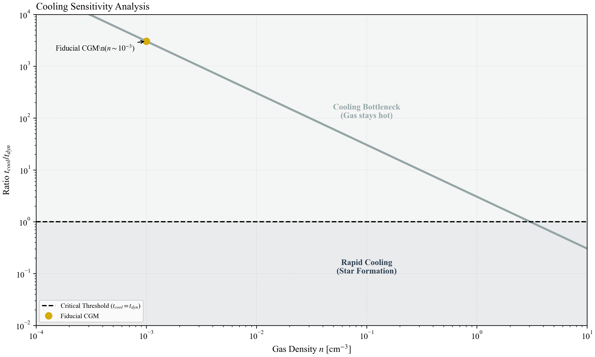
Figure 2: Cooling Sensitivity Analysis. The ratio of cooling time to dynamical time ($t_{\text{cool}}/t_{\text{dyn}}$) as a function of gas density. For standard CGM densities ($n \sim 10^{-3}$ cm$^{-3}$), the ratio is $\gg 1$, indicating a cooling bottleneck.

#### The Observational Verdict

Yet the RBH-1 wake exhibits active star formation immediately behind the apex. The observed stellar continuum colors are "well-fit by a simple model that has a monotonically increasing age with distance from the tip" (van Dokkum et al. 2023)—the youngest stars are at the tip, not 35 kpc behind it where the cooling delay would place them. This creates a fundamental tension:
- If the gas was heated to $10^7$ K, it cannot cool fast enough to form stars ($t_{\rm cool}/t_{\rm dyn} \approx 30$).
- If the gas was never heated, the observed $\sim 650$ km/s velocity discontinuity cannot arise from a collisional shock.

Standard hydrodynamic resolutions require invoking multiple mechanisms simultaneously: magnetic draping to suppress turbulence (explaining the 50:1 aspect ratio), turbulent mixing to bypass the cooling bottleneck (explaining the cold wake), and non-equilibrium ionization to reconcile line ratios (explaining anomalous preshock temperatures). Critically, these mechanisms are dynamically antagonistic—magnetic draping creates the laminar sheath that suppresses the turbulent mixing required to solve the cooling problem.

This motivates considering a non-thermal driver. It is proposed that the observed velocity discontinuity ($\sim 650$ km/s) may reflect coherent acceleration by a proper-time gradient—a metric shock in the dynamical, rather than endpoint-redshift, sense. The resolved centroid span is then real bulk motion organized by Temporal Shear, while the much smaller local line dispersion measures random and unresolved differential motion. A conservative scalar body force can separate those first and second moments without identifying the full centroid span with thermal energy.

## The Geometry Problem

The wake's geometry is also nontrivial. Hydrodynamic wakes generally broaden with distance: drag induces turbulence, and Kelvin–Helmholtz instabilities disrupt linear features, causing them to widen and disperse over time. Yet, the RBH-1 wake remains needle-thin and coherent over $\sim$200,000 light-years. It does not broaden as a typical turbulent wake; it remains exceptionally collimated.

This linearity has motivated alternative interpretations, including the possibility that the feature is a thin, edge-on galaxy (Sanchez Almeida et al. 2023). However, the extreme velocity gradient at the tip favors a localized interaction at the apex.

## Implications
The coexistence of a large kinematic discontinuity and weak thermalization creates a cooling bottleneck ($t_{\mathrm{cool}} \gg t_{\mathrm{dyn}}$) that places simple single-phase hydrodynamic bow-shock interpretations under quantitative tension.
Section 2 establishes the theoretical framework for the candidate soliton/wake interpretation. Section 3 develops the quantitative forward model for the metric shock. Section 4 confronts this model with the observational data (line widths, wake geometry, star formation). Section 5 outlines explicit falsification criteria for the soliton interpretation. Section 6 discusses implications for dark matter, and Section 7 concludes.

## 2. Theoretical Framework: The Soliton/Wake Interpretation

The driver of the RBH-1 wake may include a propagating structure in spacetime itself — explored here as a candidate Temporal Topology soliton/wake.† This *would be* a coherent region of altered proper-time rate moving with the compact object (consistent with non-topological soliton solutions; see Kusenko 1997). Universal coupling makes the associated Temporal Shear dynamically active: as the structure traverses a gas cloud, matter experiences the conservative acceleration $\mathbf a_\phi=-c^2\boldsymbol\nabla\ln A$. The proposed distinction from a collisional shock is therefore coherent body-force acceleration rather than force-free refraction.

† *Terminology note:* Here, "soliton" refers specifically to a non-topological defect in a scalar field (a Q-ball or oscillon analog) that saturates at a finite density $\rho_T$, distinct from the vacuum singularity solutions of pure General Relativity. While Schwarzschild and Kerr black holes are sometimes called "gravitational solitons" in the mathematical sense of stationary, localized solutions, the objects considered here have no event horizon and are characterized by a finite core density rather than a central singularity. Two distinct existence questions should not be conflated: the configuration invoked here is *matter-sourced* — bound to the compact object as its temporal well — so its existence reduces to a forced boundary-value problem, to which self-binding (Derrick-type) obstructions for free field lumps do not apply; the Q-ball/oscillon language is morphological analogy only. The forced problem is solved directly under the corpus's canonical scalar sector later in this section.

#### Box 2.0: Phenomenological vs. Microphysical Reading
This section can be read at two levels:
- *Phenomenological (model-agnostic):* A compact object carrying a coherent proper-time gradient, characterized by a characteristic density $\rho_T \approx 20$ g/cm³, can organize a large bulk-velocity gradient without assigning the full velocity span to random thermal motion. The observational consequences—locally narrow lines, prompt collapse, and extreme collimation—follow from the coherence and work integral of the body-force profile.
- *Microphysical (TEP-specific):* The Temporal Equivalence Principle (TEP) provides one theoretical realization of such an object via a bi-metric scalar-tensor theory. Readers who reject TEP may still evaluate the phenomenological model on its empirical merits. Within the TEP reading, the required configuration is the compact object's matter-sourced temporal well — a forced solution of the field equation, not a self-bound free soliton — whose existence under the canonical scalar sector is demonstrated numerically in this section.
**Crucial Concept: Permeability.** Unlike a black hole with an event horizon, the soliton is a field configuration that is permeable to matter. Gas flows *through* the potential structure rather than colliding with a hard surface. The interaction is metric-gradient driven rather than surface-impact driven: momentum is transferred coherently by the universal scalar force, with heating controlled by unresolved differential motion and streamline crossing rather than by the bulk centroid span itself.
The key empirical claim—that a characteristic density $\rho_T \approx 20$ g/cm³ governs compact-object structure across 15 orders of magnitude in mass—is testable independently of the theoretical framework used to motivate it.

## Phenomenology of the Time Lens

In this framework, RBH-1 acts as a moving proper-time potential. Inside the candidate profile, time flows more slowly relative to the ambient background ($d\tau < dt$). The spatial variation of that rate is physical: in the weak-field matter metric it accelerates gas according to $\mathbf a_\phi=-c^2\boldsymbol\nabla\ln A$. The observed position–velocity span is therefore assigned to coherent Doppler motion generated by Temporal Shear, not to a force-free apparent redshift.

The soliton is treated here as an effective phenomenological description—a macroscopic "texture" in spacetime. One theoretical realization arises from the bi-metric scalar-tensor structure of TEP (Smawfield 2025a, 2025g), where the gravitational metric $g_{\mu\nu}$ governs curvature while an effective matter metric $\tilde{g}_{\mu\nu}$ encodes the local proper-time rate. This implies a decoupling where kinematics (driven by $\tilde{g}_{\mu\nu}$) can be strong while lensing — sourced only by the scalar's distributed stress-energy in $g_{\mu\nu}$, suppressed by $\Delta\ln A/4$ relative to the apparent kinematic mass (§4) — remains weak. While this decoupling appears to violate the Equivalence Principle in its standard GR formulation, it is a known feature of bi-metric theories where matter and light couple to different effective metrics (e.g., Disformal Gravity models). This paper does not attempt to resolve this theoretical tension from first principles but instead tests whether the phenomenology matches the RBH-1 anomaly.

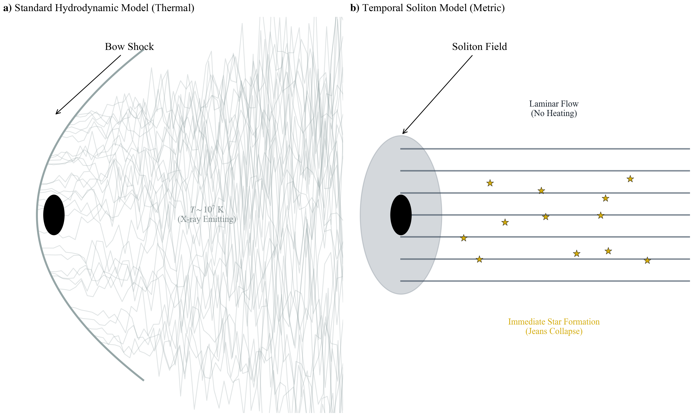
Figure 3: The Anatomy of the Wake. *Left (turbulent/hot):* A standard hydrodynamic model, where a physical projectile generates turbulence and post-shock heating ($T \gtrsim 10^7$ K). Kelvin-Helmholtz instabilities disrupt the wake boundary, and the Jeans length exceeds 100 kpc, suppressing sub-kpc fragmentation. *Right (coherent-shear):* a metric-gradient model in which a propagating proper-time profile supplies an ordered body force. A large resolved bulk-velocity span can coexist with small local random dispersion when the shear is coherent; gas can remain near $T \sim 10^4$ K, the wake boundary can stay sharp, and fragmentation into star-forming clumps is permitted.

The characteristic density $\rho_T \approx 20$ g/cm³, which governs the temporal scale, is not a free parameter in this analysis. It is an external input derived from terrestrial constraints in the companion "Temporal Topology Saturation Scale" paper (Smawfield 2025g). This analysis tests whether this specific value, calibrated on Earth, correctly predicts the wake properties of a distant supermassive black hole.

#### Box 2.1: Model Scope
Detailed field equations and Lagrangian derivations are provided in Smawfield (2025a, *TEP-GTE*) and Smawfield (2025g, *TEP-UCD*). This paper focuses strictly on the Astrophysical Forward Model: given a characteristic density $\rho_T \approx 20$ g/cm³, what are the observable kinematic and thermodynamic signatures of a $10^7 M_\odot$ soliton traversing the circumgalactic medium?

The characteristic temporal scale $R_T$, while calibrated from terrestrial geodetics, operates here as the astrophysical geometric realization of the abstract environmental operator $\mathcal{S}_\Sigma(\mathcal{E})$. Modeling the RBH-1 wake as a candidate Temporal Topology soliton uses this geometric saturation profile to trace the continuous un-screening of the temporal shear field behind the metric shock, distinguishing it fundamentally from standard bulk thermalization models.

## Forward Model: From Field Gradient to Coherent Velocity Flow

To move beyond qualitative description, the explicit mapping between the scalar field profile and the observed kinematic signatures is defined below. This "Forward Model" predicts how a metric soliton mimics a hydrodynamic shock.

### Endpoint Transport and Matter Dynamics
In the TEP framework, the effective matter metric $\tilde{g}_{\mu\nu}$ is conformally related to the gravitational metric $g_{\mu\nu}$ by a scalar function $A(\phi)$. The proper time interval $d\tau$ for a comoving observer is related to the coordinate time $dt$ by:
\begin{equation} \label{eq:proper_time} d\tau = A(\phi) dt \end{equation}
An emitter resident on a different conformal plateau from the observer has the endpoint clock ratio
\begin{equation} \label{eq:metric_redshift} 1 + z_{\text{metric}} = \frac{\nu_0}{\nu_{\text{obs}}} = \frac{1}{A(\phi)} \end{equation}
A conformal profile encountered only in the middle of the photon path contributes no additional open-path shift beyond this endpoint ratio. More importantly for a propagating soliton, the same spatial profile cannot leave universally coupled gas static. Expanding the matter geodesic in the nonrelativistic limit gives
\begin{equation} \label{eq:matter_acceleration} \mathbf a_\phi=-c^2\boldsymbol\nabla\ln A, \qquad \Delta\!\left(\frac{u^2}{2}\right)=-c^2\Delta\ln A , \end{equation}
where $u$ is the gas speed in the rest frame of a quasi-steady field profile.
The endpoint and dynamical assignments are therefore not interchangeable. Assigning $\Delta v=650$ km s$^{-1}$ to $|\Delta\ln A|\simeq\Delta v/c$ predicts a traversing-matter speed $c\sqrt{2|\Delta\ln A|}\simeq1.97\times10^4$ km s$^{-1}$ and is excluded internally. The consistent branch assigns the measured span to coherent matter motion:
\begin{equation} \label{eq:dynamical_depth} |\Delta\ln A|_{\rm dyn}=\frac{|u_{\rm out}^2-u_{\rm in}^2|}{2c^2}=\frac{\bar u\,|\Delta u|}{c^2}\equiv\eta\frac{\Delta v^2}{2c^2}. \end{equation}
Here $\eta\equiv2\bar u/\Delta v$ records the explicitly chosen flow frame. The rest-entry normalization has $\eta=1$ and $|\Delta\ln A|=2.35\times10^{-6}$. As a translating-profile benchmark, ambient gas initially at rest in the host frame and accelerated collinearly with the published $v_\bullet=954$ km s$^{-1}$ pattern has profile-frame speeds 954 and 304 km s$^{-1}$, giving $\eta=1.94$ and $|\Delta\ln A|=4.55\times10^{-6}$. The measured two-dimensional velocity field will determine $\eta$ rather than leaving the frame implicit.

### Predicting the Velocity Discontinuity

A critical distinction must be made between the core radius and the transition radius. The *temporal scale* $R_T \sim 7.8 \times 10^7$ km ($\approx 2.5\times10^{-9}$ kpc) is the fundamental geometric scale where the field saturates (derived from $\rho_T$). However, because the Temporal Topology is flattened in the deep density well of the compact object, the local Temporal Shear (field gradient) is strongly suppressed in the core region. The observable kinematic effects therefore manifest at the *transition radius* $R_{\rm trans} \sim 0.1$–$1$ kpc, where the Temporal Shear recovers continuously from its suppressed value.

The separation between these scales is parametrized explicitly as $R_{\rm trans} = \xi\,R_T$, and the data fix the prefactor: the observed $\sim 1$ kpc onset requires $\xi \approx 4\times10^{8}$ (range $4\times10^7$–$4\times10^8$ over the quoted 0.1–1 kpc interval). For comparison, the constant-density screening ansatz of Paper 6 — shear recovery where the enclosed mean density of the dynamically equivalent halo ($M_{\rm eff} \sim 4.9\times10^{10}\eta M_\odot$, Box 3.1) falls to $\rho_T$ — would place the transition at $\xi_\rho \approx 13.5\eta^{1/3}$, i.e. $\sim 7\eta^{1/3}$ AU. The measured onset therefore sits $\sim 3\times10^{7}\eta^{-1/3}$ times beyond the naive recovery radius: the shear-recovery profile is far broader than a constant-density reading, and the transfer function relating the saturation scale to the resolved onset is quantified rather than assumed. Equivalently, a recovery length $\ell \sim R_{\rm trans} \sim 1$ kpc corresponds to an effective field mass $m_{\rm eff}c^2 = \hbar c/\ell \approx 6.4\times10^{-27}$ eV — the scale the field solution must supply. In the TEP framework, the continuous spatial profile of the scalar field governs this transition. The observed position–velocity structure constrains the work integral of $A(\phi)$ across that boundary.

Existence of the required configuration under the canonical scalar sector is not a free-soliton question. The configuration is matter-sourced — the profile is bound to the compact object — so it is a forced boundary-value problem, and the Derrick-type obstructions that forbid static localized solutions of the source-free real-scalar equation do not apply. Solving the corpus's kinetic completion $P(X,\phi)=X-V+X|X|/\Lambda^{4}$ on the static spherical branch gives the flux-conserving profile $s\,[1+(s/\Sigma_{\rm bg})^{2}]=2\beta_A^{2}GM/(c^{2}r^{2})$ for the observable shear $s=|\nabla\ln A|$, with the shear floor $\Sigma_{\rm bg}=H_0/c$ and threshold $g_t=cH_0/(2\beta_A^{2})$ fixed cosmologically rather than fitted (Paper 0, master-action closure). For the baryonic mass alone this returns a localized, positive, monotonic halo with canonical $r^{-2}$ tail, a stiff $r^{-2/3}$ interior branch, and a shear-recovery radius $R_s=\sqrt{GM/g_t}\approx90$ pc — within an order unity factor of the resolved onset band, and moving into it ($R_s\propto\sqrt M$) for a sourcing strength above the baryonic mass. The interior amplitude sector independently saturates at the corpus quartic equilibrium, $\varphi_{\min}(\rho_T)\simeq3.2\times10^{-7}$ at the reference coupling. Because the halo relaxes on its light-crossing time $R_s/c\approx300$ yr — four orders of magnitude faster than the $\sim$Myr gas transit — the moving object adiabatically carries its well, and no metastability timescale is required of the configuration. The halo depth delivered by the bare baryonic charge, $7.8\times10^{-8}$ at its interior ceiling, falls short of the required $2.35\times10^{-6}\eta$ by the same open response-depth normalization already carried as $\alpha_{\rm RBH,eff}$ (Box 2.2): the existence of the configuration class is thereby established under the canonical action, with the depth normalization remaining a disclosed open item rather than an additional defect. (Existence audit: Reproducibility, step 02.)

For bookkeeping against the baryonic potential, define the operational response $\alpha_{\text{RBH,eff}}$ by $|\Delta\ln A|=\alpha_{\text{RBH,eff}}GM/(R_{\rm trans}c^2)$. In the rest-entry normalization the work integral gives

\begin{equation} \label{eq:velocity_discontinuity} \Delta v \approx \left(\frac{2\alpha_{\text{RBH,eff}}GM}{R_{\text{trans}}}\right)^{1/2}. \end{equation}

#### Box 2.2: The Temporal Shear Constraint
The field amplitude and its gradient must be separated. A uniform conformal plateau can generate an endpoint clock ratio but no local force; a propagating spatial transition necessarily accelerates matter. The observed 650 km s$^{-1}$ span therefore fixes the integrated gradient dynamically, not linearly as a redshift.
The observed velocity discontinuity ($v \approx 650$ km/s) combined with the transition scale ($R_{\text{trans}} \sim 1$ kpc) constrains the effective coupling product at the radius where Temporal Shear has recovered:
\begin{equation} \label{eq:coupling_constraint} \alpha_{\text{RBH,eff}} \frac{GM}{R_{\text{trans}} c^2} \sim \eta\frac{1}{2}\left(\frac{\Delta v}{c}\right)^2 = 2.35\times10^{-6}\eta . \end{equation}
For $M = 2\times 10^7 M_\odot$ at $R_{\rm trans} \sim 1$ kpc, $GM/(R_{\rm trans}c^2)=9.57\times10^{-10}$, giving $\alpha_{\rm RBH,eff}=2.46\times10^3\eta$ or a Newtonian-equivalent mass $M_{\rm eff}=4.91\times10^{10}\eta M_\odot$. The rest-entry value is smaller by a factor of 921 than the obsolete endpoint-redshift assignment; the collinear pattern-speed benchmark is smaller by a factor of 476. Under the soliton reading this is the configuration's integrated dynamical depth; under a linear-response reading it is a constraint on the open screening-transfer normalization. No independent force suppression is introduced: the observed bulk motion is the response to the same universal gradient.

### Predicting Line Widths (The Discriminator)

The key distinction lies in the second moment of the line distribution (line width).
- **Thermal Shock:** The velocity jump comes from chaotic thermalization. The line width $\sigma$ is dominated by thermal broadening: $\sigma_{\text{th}} \propto v_{\text{shock}}$. For $v \sim 1000$ km/s, $\sigma \sim 100$ km/s.
**Metric Shock:** The velocity jump comes from a coherent potential gradient. The line width is dominated only by the gradient variation across the telescope beam width plus the intrinsic cold-gas thermal width:
\begin{equation} \label{eq:line_width} \sigma_{\text{obs}}^2 = \sigma_{\text{th,cold}}^2 + \sigma_{\text{grad}}^2 + \sigma_{\text{inst}}^2 \end{equation}
Since the gas can remain cold ($T \sim 10^4$ K, $\sigma_{\text{th}} \sim 10$ km/s) while sharing an ordered velocity field, the predicted local line width is narrow ($\sigma \ll \Delta v$). The published 31 km s$^{-1}$ dispersion and the 650 km s$^{-1}$ resolved span are distinct observables; their ratio constrains field non-uniformity only where the emitting components are shown to be co-spatial.

Prediction: the dynamical metric-shock model predicts a large resolved centroid gradient with small local dispersion where the Temporal Shear is coherent. If the 31 km s$^{-1}$ component samples the same flow, $\sigma/\Delta v=0.048$ and the corresponding rms depth non-uniformity is bounded at approximately $2\sigma/\Delta v\simeq0.095$.

## Thermodynamics of a Metric Shock

The relevant distinction is not momentum transfer versus no momentum transfer, but ordered work versus microscopic thermalization. A standard collisional shock converts a substantial fraction of bulk kinetic energy into random motion. Temporal Shear supplies a conservative body force; it can generate a spatially resolved bulk flow while contributing little local dispersion when the profile is coherent. Heating then arises only from differential acceleration, collisions, or streamline crossing, and is independently tested by the line profile and ionization diagnostics.
- Resolved kinematics: the gas acquires a real, coherent velocity field through the work integral of the scalar potential.
- Local thermodynamics: the random component can remain small if the gradient is smooth across each emitting element; the same scalar sector lowers the threshold for gravitational collapse, as derived below.

#### Box 2.3: Derivation of the Modified Jeans Mass

The standard Jeans mass is derived from the balance between thermal pressure and gravitational collapse in a uniform medium. The collapse timescale is $t_{\rm ff} \sim (G\rho)^{-1/2}$, while the sound-crossing timescale is $t_{\rm sound} \sim \lambda_J / c_s$. Setting these equal yields the Jeans length $\lambda_J \sim c_s / \sqrt{G\rho}$ and Jeans mass $M_J \sim \rho \lambda_J^3 \sim c_s^3 / (G^{3/2} \rho^{1/2})$.

In the TEP framework, the matter metric $\tilde{g}_{\mu\nu} = A^2(\phi) g_{\mu\nu} + B(\phi)\nabla_\mu\phi\nabla_\nu\phi$ rescales proper time in the conformal sector: $d\tau = A(\phi) dt$. Define $\gamma \equiv dt/d\tau = 1/A(\phi) > 1$ inside the soliton (where $A < 1$). A uniform conformal rescaling cannot by itself alter a local instability criterion: under the corpus axiom that matter-frame physics is locally standard (Rules 2 and 21), the free-fall and sound-crossing times rescale together and their ratio is invariant. The collapse criterion is modified only through a change in the effective inter-particle force:
- **Scalar fifth force:** In the Jordan frame (where matter couples to $\tilde{g}_{\mu\nu}$), the scalar field mediates an additional attractive interaction between matter elements, so the effective gravitational coupling is $\tilde{G} = G(1 + \alpha_{\rm eff}^2)$, where the scalar-charge normalization $\alpha_0^2 = 2\beta_A^2$ follows the corpus-wide DEF convention $\alpha_0 = \sqrt{2}\,\beta_A$ (Paper 0) and $\alpha_{\rm eff}$ is the environment-dependent screened charge. In the unscreened regime ($\beta_A = -1$, $\alpha_{\rm eff} \to \alpha_0 = -\sqrt{2}$) this gives $\tilde{G} = 3G$; in the screened regime the fifth force vanishes and $\tilde{G} \to G$. Gravity is enhanced where the scalar charge is unscreened.
- **Frame bookkeeping:** Conformal factors of $A(\phi)$ that appear when the gravitational action is written in Jordan-frame variables are unit-conversion effects; they cancel between the gravitational coupling and the local standards that define $c_s$ and $\rho$, and therefore carry no independent factor into the local criterion. The physical content of the temporal field for collapse dynamics is the screened scalar charge $\alpha_{\rm eff}(\phi, \nabla\phi)$ — which is environment-dependent through the same field configuration that produces the metric shock.

The modified Jeans mass in the matter frame is:
\begin{equation} \label{eq:jeans_mass} \tilde{M}_J \sim \frac{c_s^3}{\tilde{G}^{3/2} \rho^{1/2}} = \frac{c_s^3}{[(1+\alpha_{\rm eff}^2)\, G]^{3/2} \rho^{1/2}} = \frac{M_J}{(1+\alpha_{\rm eff}^2)^{3/2}} \end{equation}
At the bare coupling $\alpha_{\rm eff}^2 = \alpha_0^2 = 2$ this gives $\tilde{M}_J = M_J / 3^{3/2} \approx 0.19\, M_J$ — a factor of five reduction without invoking any timescale rescaling. In the deep-field regime, where the effective charge can exceed the bare value, the reduction is correspondingly deeper.
The quantitative bookkeeping is worth stating plainly. For unperturbed circumgalactic gas ($T\sim10^{4}$ K, $n\sim10^{-3}$ cm$^{-3}$, $c_s\simeq15$ km s$^{-1}$) the Newtonian Jeans mass is $M_J\sim10^{9}\,M_\odot$ (Jeans length $\sim50$ kpc, far exceeding the $\sim1$ kpc wake width — ambient gas is stable by roughly two orders of magnitude in size). The bare-coupling factor alone therefore does not collapse diffuse ambient gas; it reduces the threshold to $\sim2\times10^{8}\,M_\odot$ ($\lambda_J\sim30$ kpc). The operative statement is instead the reclassification of denser condensations: at fixed clump mass the critical density for instability falls by $(1+\alpha_{\rm eff}^{2})^{3}=3^{3}=27$ at the bare coupling (equivalently, the Jeans length at fixed density falls by $\sqrt{3}$), so gas at a few percent of the usual threshold density is already unstable. Evaluated at the compressed densities of condensing $10^{4}$ K gas ($n\sim1$–$10^{2}$ cm$^{-3}$), the reduced criterion reaches the $10^{6}$–$10^{7}\,M_\odot$ regime of the stellar clumps that actually populate the wake — at bare coupling alone. A still deeper reduction demanded of near-ambient gas would depend on the open environmental-charge transfer map; it is not used to cancel the real acceleration derived above.
**Caveat on the sound speed:** This derivation assumes $c_s$ is unchanged, which holds if the gas temperature is set by external radiation (CMB floor) rather than local thermodynamics.
**Caveat on regime of validity:** The estimate above is a quasi-static, weak-field linearization. Inside the deep core ($\gamma \sim 2$–$3$) and at the large effective couplings required to produce the observed shock amplitude, the collapse criterion must be evaluated within the full nonlinear field configuration; the linearized value is an estimate of direction and scale, not the nonlinear answer.
The timescale structure of the field configuration fixes where the reduced criterion can act:
- **Transition zone and trailing wake ($R \sim 1$ kpc):** The work-integral depth is $2.35\times10^{-6}\eta$; the rest-entry traversal time over 1 kpc is approximately 3.0 Myr. Because this remains far shorter than the ambient free-fall time, passage can reclassify or precondition marginal condensations, but collapse must complete in denser gas or after passage.
- **Core zone ($R \sim 10^8$ km):** The potential is deepest here and the local mass reduction is largest, but the core-diameter transit is only $\sim$ days — orders of magnitude shorter than the free-fall time, so collapse cannot complete, or even substantially advance, during core passage. The core's role is a seeding impulse: a brief interval of strongly enhanced effective gravity that pre-compresses gas which then resides inside the trailing wake disturbance, where the reduced criterion applies for the $\sim$ Myr wake-crossing time rather than the $\sim$ day core transit.
The primary observational claim relies on the transition-zone kinematics (the metric shock); the wake-resident collapse enhancement is a secondary mechanism for the star-formation efficiency.

The key point is that the Jeans-mass reduction is a derived consequence of the scalar fifth force, not an ad hoc assumption. Its magnitude is set by the environment-dependent scalar charge $\alpha_{\rm eff}$, which is tied to the same field configuration constrained by the observed velocity discontinuity and the saturation scale.

The measured $\sim 600$–650 km s$^{-1}$ span is therefore retained as bulk flow, but its energy source is reassigned to the Temporal-Shear work integral rather than to an endpoint clock offset. The translational speed $v_{\bullet} = 954$ km s$^{-1}$ remains a measured boundary condition, not a field-theoretic output; it sets the wake age $t_{\rm wake} \sim L/v_{\bullet} \sim 70$ Myr and encounter geometry. The two velocities remain distinct: $v_{\bullet}$ describes the compact object's ballistic motion, while $\Delta v$ constrains the scalar profile's integrated dynamical depth.
The Discriminator: How can these models be distinguished? The primary discriminant is the line profile.
In a thermal shock where the emitting gas is predominantly hot, a large velocity change ($v$) implies a high temperature ($T \propto v^2$), which broadens spectral lines via thermal Doppler motion ($\sigma_v \propto \sqrt{T}$). Even in multiphase scenarios where [O III] arises from cooler zones, a substantial hot-phase contribution should produce detectable broad wings.
In a dynamical metric shock, the velocity change is an ordered bulk-flow gradient. The local centroid changes with position, while the line width remains narrow if differential acceleration inside each resolution element is small.

## The Solution to the Paradox
This mechanism separates coherent kinetic energy from random thermal energy. Star formation can proceed in the cold component because the scalar profile organizes the bulk flow and lowers the Jeans threshold; it does not require the full 650 km s$^{-1}$ span to thermalize locally. The cooling analysis (Section 1) shows that a single-phase $10^7$ K interpretation has $t_{\mathrm{cool}}/t_{\mathrm{dyn}}\sim30$. The dynamical metric-shock alternative is therefore tested by the joint spatial velocity field, local line widths, broad-wing limits, and gas–star kinematic relation.

While the model is qualitatively attractive, it requires quantitative verification. If RBH-1 is a soliton, it must have a specific size. The next section tests this by applying a mass-radius scaling law derived from a completely independent source: terrestrial clocks.

## 3. Quantitative Predictions: Testing the Dynamical Metric Shock
The metric-shock hypothesis proposes that the observed resolved velocity
span Δv ~ 650 km/s is coherent matter motion generated by a spatial gradient in the conformal
factor A(φ), which relates the matter metric to the gravitational metric via
$\tilde{g}_{\mu\nu} = A^2(\phi) g_{\mu\nu} + B(\phi)\nabla_\mu\phi\nabla_\nu\phi$
(conformal limit for this analysis). This section derives the required
field parameters and checks for internal consistency.

Screening in TEP is represented at the theory level by the environmental operator
*S*&Sigma;(*&Epsilon;*).
Quantities such as
&rho;T,
*R*T(*M*),
*S*&oplus;(*r*),
compactness &Phi;/*c*2,
local stellar density,
geometric coherence length,
and channel-specific response coefficients
are domain-specific projections of *&Epsilon;*,
not independent screening mechanisms
and not interchangeable universal thresholds.
Each is an observational transfer model
that parameterizes the same underlying operator
in a regime-appropriate form.
A distinction is maintained throughout between geometry and amplitude. The
temporal scale (and associated geometric scaling) is fixed
*a priori* by $\rho_T$ (Paper 6), while the magnitude of the coherent
kinematic discontinuity depends on screening/transition physics through the
effective coupling at $R_{\text{trans}}$ and is therefore treated here as an
empirical constraint rather than an independent free fit.

### Table 2: Model Inputs vs. Predictions

| Parameter | Type | Source | Value/Role |
| --- | --- | --- | --- |
| **Characteristic Density** ($\rho_T$) | **Fixed Input** | TEP-UCD (Paper 6) | $\approx 20$ g/cm³ (derived from GNSS). Sets temporal scale. |
| **Baryonic Mass** ($M$) | Observation | van Dokkum et al. (2025) | $\sim 2 \times 10^7 M_\odot$. Sets scale via $R \propto
(M/\rho_T)^{1/3}$. |
| **Temporal Scale** ($R_T$) | **Prediction** | Derived from $\rho_T, M$ | $\approx 1.3 R_S$. **Consistency Check:** Crossover-mass
coincidence internal to the theory ($R_T$ is $\sim 8.6$ orders
below the resolved scale); the observed onset is carried by
$R_{\rm trans} = \xi R_T$, $\xi \approx 4\times10^{8}$. |
| **Coupling Strength** ($\alpha_{\text{RBH,eff}}$) | **Constraint** | Fitted to Data | constrained by $|u_{\rm out}^2-u_{\rm in}^2|/(2c^2)$ through the profile-frame work integral. |
| **Velocity Jump** ($\Delta v$) | Constraint | Observation | Used to set $\alpha_{\text{RBH,eff}}$; NOT a prediction. |
| **Line Width** ($\sigma$) | **Prediction** | Soliton Physics | Predicted locally narrow ($\ll \Delta v$) where Temporal Shear is coherent; the published near-tip width is not an unresolved width of the full spatial span. |
Box 3.0: Origin of the Characteristic Density ($\rho_T \approx 20$ g/cm³)
The value $\rho_T \approx 20$ g/cm³ is not a free parameter tuned for
RBH-1. It is derived in the companion paper
*Temporal Topology Saturation Scale* (Smawfield 2025g) strictly from an
analysis of terrestrial atomic clocks, independent of any astrophysical
data.
*Summary of Derivation:*
TEP posits that the local speed of light is invariant, while the
rate of matter clocks is set by the temporal field through the
conformal factor $A(\phi)$ &mdash; deeper in a potential well,
clocks run slower relative to the ambient. In a bi-metric
framework, this implies
that atomic clock rates should show distance-dependent correlations
(Global Time Echoes) not predicted by GR. Analysis of 25 years of GNSS
clock data reveals such correlations, with a characteristic decoherence
length that maps to a universal density scale $\rho_T$.
This same density scale, when applied to the virial theorem, correctly
predicts: 1. The Bohr radius (atomic scale). 2. The deviation of
galactic rotation curves (at $\rho \ll \rho_T$). 3. The crossover-mass
coincidence of the RBH-1 soliton candidate ($R_T \approx 1.3\,R_S$ at
the nominal anchor).
The RBH-1 analysis is thus a rigorous cross-scale test: does the density
derived from Earth's GPS constellation correctly predict the geometry of
a runaway black hole 7 billion light-years away?
*Robustness:* The geometric prediction scales as $R_T
\propto \rho_T^{-1/3}$. Propagating the measured product-level
calibration ensemble ($\lambda_T \approx 1{,}400$–$4{,}500$ km across
the CODE/IGS/ESA pooled, Paper 14, Paper 33, and held-out MGEX
products) returns $\rho_T \approx 15$–$524$ g/cm³ and
$R_T/R_S \in [0.44, 1.45]$ for RBH-1: the crossover coincidence is
uncalibrated at its own falsification boundary, with the pooled
calibrations placing the object outside the horizon scale and the
finest-scale products inside it. This sensitivity is itself a
falsifiability criterion: the GNSS transfer-map resolution tracked in
Papers 1, 14, and 33 will either tighten or break the RBH-1
concordance.

## Transport-Consistent Conformal Factor Gradient
The resolved position–velocity structure runs from approximately $-600$ to
$+50$ km s$^{-1}$ across 1 kpc, giving $\Delta v=650$ km s$^{-1}$. The
former endpoint assignment converted this linearly to
$|\Delta\ln A|\simeq\Delta v/c$. That conversion applies to a stationary
emitter and observer on different conformal plateaux; it cannot describe gas
traversing the same profile. Universal matter coupling instead gives
\begin{equation} \label{eq:matter_work} \mathbf a_\phi=-c^2\boldsymbol\nabla\ln A,\qquad
\Delta\!\left(\frac{u^2}{2}\right)=-c^2\Delta\ln A , \end{equation}
The endpoint depth $\ln(1+\Delta v/c)=2.166\times10^{-3}$ would therefore
accelerate matter from rest to $1.973\times10^4$ km s$^{-1}$, 30.4 times
the observed span. In the rest frame of a quasi-steady profile, let $u$
denote the gas speed and define $\eta=2\bar u/\Delta v$. The dynamically
consistent depth is then
\begin{equation} \label{eq:log_a} |\Delta\ln A|_{\rm dyn}=\frac{|u_{\rm out}^2-u_{\rm in}^2|}{2c^2}
=\eta\frac{\Delta v^2}{2c^2}=2.350\times10^{-6}\eta . \end{equation}
Rest entry gives $\eta=1$. A collinear translating-profile benchmark using
the published 954 km s$^{-1}$ pattern speed gives profile-frame entry and
exit speeds 954 and 304 km s$^{-1}$, hence $\eta=1.94$ and
$|\Delta\ln A|=4.55\times10^{-6}$. Across 1 kpc the rest-entry normalization
gives $|\nabla\ln A|=7.62\times10^{-26}$ m$^{-1}$ and
$|a_\phi|=6.85\times10^{-9}$ m s$^{-2}$. A Newtonian fit reads the same
acceleration as $M_{\rm app}=4.91\times10^{10}\eta M_\odot$ at 1 kpc. On the
canonical kinetic branch, the shell ledger gives
$E_{\rm scalar}=(|\Delta\ln A|/4)M_{\rm app}=2.89\times10^4\eta^2M_\odot$ and
$M_{\rm app}/E_{\rm scalar}=1.70\times10^6/\eta$. Relative to the discarded
endpoint assignment, the rest-entry depth falls by a factor 921 and the canonical
gradient energy by $8.49\times10^5$; the pattern-speed benchmark gives
factors 476 and $2.27\times10^5$, respectively. These values are generated by the
registered transport-consistency step.

## Lensing and Kinematic Signatures
A critical prediction of the conformal scalar-tensor framework is the
quantitative asymmetry between matter response and scalar stress-energy.
The scalar field $A(\phi)$ generates coherent matter acceleration through
the matter metric. Light follows
the gravity metric $g_{\mu\nu}$, which is sourced by the total
stress-energy — the baryonic mass plus the scalar contribution
evaluated above. At the dynamical depth its projected canonical surface
density is $\Sigma_{\rm scalar}=2.30\times10^{-3}\eta^2
M_\odot\,{\rm pc^{-2}}$ for the stated shell geometry, far below a
cosmological strong-lensing critical density. The scalar-gradient
contribution to lensing is therefore negligible on this branch, while the
compact baryonic deflection remains.
For light passing through the wake boundary ($b \sim 1$ kpc), the
compact deflection angle depends only on the baryonic mass
$M \approx 2 \times 10^7 M_\odot$:
\begin{equation} \label{eq:lensing_angle} \theta_{\text{lens}} \sim \frac{4GM}{c^2 b} \sim \frac{4 \times 6.67
\times 10^{-11} \times 2 \times 10^7 \times 2 \times 10^{30}}{(3 \times
10^8)^2 \times 3 \times 10^{19}} \sim 4 \times 10^{-9} \text{ rad} \approx
0.8 \, \text{mas} \end{equation}
This value ($\sim 0.8$ milliarcseconds) is far below current observational
limits (HST resolution $\sim 50$ mas).

#### The Lensing Discriminator
This provides a sharp test against a particulate halo interpretation.
A particulate mass $M_{\rm app}\simeq4.9\times10^{10}\eta M_\odot$ inside
1 kpc would produce order-arcsecond strong lensing, whereas the canonical
scalar configuration carrying the same matter acceleration contains only
$2.9\times10^4\eta^2M_\odot$ in gradient energy. The predicted
kinematic-to-scalar-lensing mass ratio is $1.70\times10^6/\eta$, versus unity
for a particulate model. Deep imaging or weak-shear mapping therefore
tests the dynamical Temporal-Shear assignment without relying on an
endpoint-redshift channel.
Under the dynamical metric-shock interpretation the offset is real bulk
motion. Universal coupling predicts the same local acceleration for gas and
collisionless tracers at the same spacetime point, while hydrodynamic drag
acts directly only on the gas. Newly formed stars should therefore inherit
the local gas centroid at formation:
\begin{equation} \label{eq:stellar_velocity} \Delta v_\star(x_{\rm form}) \simeq
\Delta v_{\rm gas}(x_{\rm form}),\qquad
\Delta\!\left(\frac{v^2}{2}\right)=-c^2\Delta\ln A . \end{equation}
The decisive observable is the gas–star velocity relation along the wake:
a universal metric force predicts a composition-independent acceleration
law and a formation-epoch imprint in the stars, whereas ram pressure and
turbulent entrainment permit systematic gas–star slip. Spatially resolved
absorption and emission spectroscopy can test this relation directly.

## Screening and Parameter Consistency
The above estimates assume the scalar field profile is governed by
continuous Temporal Topology, where the local field gradient (Temporal
Shear) is suppressed in deep density wells. The phenomenological scaling
ansatz (detailed in Smawfield 2025e) is adopted:
Unlike traditional chameleon mechanisms that invoke discrete thin-shell boundaries
with sharp density cutoffs, TEP screening operates through continuous field gradient
flattening. The Temporal Shear is gradually suppressed in deep potential wells,
avoiding the fine-tuning problems of thin-shell approximations while maintaining
Temporal Shear suppression in dense environments.
\begin{equation} \label{eq:screening_factor} S = \frac{\beta_0}{\alpha_{\text{RBH,eff}}} \propto
\left(\frac{\rho}{\rho_T}\right)^{1/3} \end{equation}
This $S$ is a coupling ratio&mdash;the bare coupling $\beta_0$ divided
by the screened effective coupling $\alpha_{\text{RBH,eff}}
mdash;and
should not be conflated with the clock-amplitude response factor of
Paper 6, $S_A = (\bar{\rho}/\rho_T)^{1/3}$, a radius ratio evaluated at
a body's mean density. The two share the $(\rho/\rho_T)^{1/3}$
saturation scaling but are distinct quantities.
For RBH-1 at the crossover mass (M ~ 10⁷ M_☉, ρ ~ ρ_T ~ 20 g/cm³), the
suppression factor is S ~ 1, meaning the Temporal Shear is near the
transition between strongly flattened and asymptotically recovered profiles.
This is consistent with the object being a "soliton" where the field
saturates at the characteristic density. Two distinct uses of
$\alpha_{\rm eff}$ must be kept separate: in the screening ansatz the
effective charge is the response channel's screened coupling, and S ~ 1 at
the crossover asserts that the shear profile transitions there — a statement
about where the field flattens, not about its amplitude. In the
velocity-discontinuity constraint (Box 2.2), $\alpha_{\rm RBH,eff} =
2.46\times 10^{3}\eta$ is the linear-response equivalent of the observed dynamical depth;
read literally as a coupling ratio, S = $\beta_0/\alpha_{\rm eff}$ at S ~ 1
would require the bare response $\beta_0$ itself to carry the same $\sim
10^{3}$ amplification — the corpus's open response-normalization question
(shared with $\kappa_{\rm Cep}$, $\kappa_{\rm MSP}$ and $\beta_{A,\rm eff}$),
stated here explicitly rather than absorbed into the ansatz.
At higher densities (e.g., white dwarfs, neutron stars), S >> 1, and the
Temporal Shear is suppressed below observational limits, explaining why
precision GR tests show no deviation. At lower densities (e.g., galaxies), S
< 1, and the scalar field produces observable "phantom mass" effects
(detailed in the companion paper, Smawfield 2025e).

#### Box 3.1: The Phantom Halo (Mass Deficit) Implication
A critical reader will note that a Newtonian potential for $M = 2 \times
10^7 M_\odot$ at $R = 1$ kpc yields $\Phi/c^2 \sim 10^{-9}$, far smaller
than the required dynamical depth $|\Delta\ln A|_{\rm dyn}=2.35\times10^{-6}\eta$.
This discrepancy implies that the scalar sector carries an effective
"Phantom Mass" of order $M_{\text{eff}} = 4.91 \times 10^{10}\eta M_\odot$
in Newtonian-equivalent terms — the enclosed mass that produces the
required coherent acceleration at $R_{\rm trans} \sim 1$ kpc — comparable to
a galactic halo. In the TEP
framework, this is not "missing matter" but a "metric
halo"—the scalar field profile maintains a deep potential well out to
$R_{\text{trans}}$, decoupling the metric potential from the compact
baryonic source. Stated as a linear response, the same amplitude
corresponds to an effective response $\alpha_{\rm RBH,eff} =
2.46\times 10^{3}\eta$ (Box 2.2); under the soliton reading it is the field
configuration's internal depth rather than a response coefficient.
**Crucially, this potential is bi-metric:** it affects the
matter motion far more strongly than the
spatial curvature sensed by light. The scalar's own stress-energy is
only $|\Delta\ln A|/4$ of the apparent kinematic mass and is distributed
through the transition volume, so the object generates a kinematic
"kick" equivalent to a massive halo while producing at most marginal,
extended lensing — not the strong arcs or extreme gas focusing
expected from $\sim 5\times 10^{10}\eta M_\odot$ of particulate matter.
**Observationally:** RBH-1 acts as a "naked halo"—a compact
baryonic object ($2 \times 10^7 M_\odot$) clothed in a metric
distortion whose Newtonian-equivalent mass is $\sim 5 \times 10^{10}\eta
M_\odot$. This explains how it
generates a wake magnitude ($\sim 600$ km/s) typical of galactic
interactions despite its small physical size.

#### Consistency Check
The transport-consistent conformal gradient ($|\Delta\ln A|=2.35\times10^{-6}\eta$ over 1 kpc)
produces:
- Coherent velocity span: $\Delta v=650$ km/s by the profile-frame work integral, with $\eta$ fixed by the resolved flow geometry
Lensing: θ ~ 0.8 mas compact deflection (baryonic; far below
current HST/JWST resolution, consistent with non-detection);
the scalar sector adds only negligible extended shear,
$\Sigma_{\rm scalar}=2.30\times10^{-3}\eta^2M_\odot\,{\rm pc^{-2}}$
Gas–star comoving relation at formation, with subsequent gas–star
slip directly testing hydrodynamic rather than universal-metric forcing
These parameters are internally consistent and do not violate existing
constraints. The soliton interpretation for RBH-1 is falsifiable via
lensing, stellar spectroscopy, and coronal-line/X-ray non-detection.

## 4. Observational Analysis: Confrontation with Data
For RBH-1 itself, direct empirical tests are available using published JWST and HST data (van Dokkum et al. 2025). Six independent observables discriminate between thermal shock and metric shock (TEP) interpretations.

## 4.1 The Line Width Test
In a single-phase thermal shock where the [O III]-emitting gas resides predominantly at $T \sim 10^7$ K, thermal Doppler motion would broaden spectral lines to $\sigma_{\text{th}} \approx 80\text{--}85$ km/s. In practice, [O III] emission in shock-heated environments often arises from cooler recombination/cooling zones rather than the hottest post-shock plasma; however, if a substantial hot-phase component contributes to the line flux, it should produce detectable broad wings. In the dynamical metric-shock model, Temporal Shear produces an ordered bulk-velocity field, so a large resolved centroid span can coexist with a narrow local line where differential acceleration inside the emitting element is small.
Higher-resolution Keck/LRIS spectroscopy of the [O III] λ5007 knot at the tip of the wake yields (van Dokkum et al. 2025, Appendix C):
\begin{equation} \label{eq:line_width_obs} \sigma_{\text{obs}} = 36 \pm 4 \text{ km/s} \quad \xrightarrow{\text{instr. corr.}} \quad \sigma = 31 \pm 4 \text{ km/s} \end{equation}
where the instrumental resolution $\sigma_{\text{instr}} = 18$ km/s has been subtracted in quadrature. The key inequality:
\begin{equation} \label{eq:line_width_inequality} \sigma_{\text{obs}} \approx 31 \text{ km/s} \ll \sigma_{\text{thermal}}(10^7 \text{ K}) \approx 85 \text{ km/s} \end{equation}
This observed dispersion is 3× smaller than expected if the [O III]-emitting gas were predominantly at $T \sim 10^7$ K, and 10× larger than pure thermal broadening at $T \sim 10^4$ K ($\sigma_{\text{th}} \approx 2$–$3$ km/s). The intermediate value ($\sigma \approx 31$ km/s) is consistent with cold gas experiencing bulk/turbulent motions or a coherent velocity gradient across the beam.

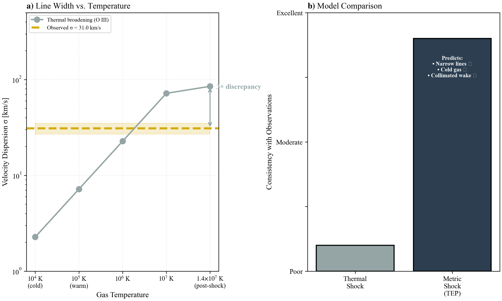
Figure 4: The Line Width Test. (A) Thermal broadening of [O III] emission as a function of gas temperature. The observed dispersion (σ = 31 km/s) is 3× smaller than expected for a simple $10^7$ K post-shock phase, placing that picture under tension. (B) Schematic illustration of how a coherent body-force velocity field can accommodate a large spatial centroid span with comparatively narrow local lines.

### Critical Next Step: Line-Profile Decomposition
The bulk line-width measurement ($\sigma = 31$ km/s) is necessary but not sufficient to rule out thermal heating. A standard thermal shock could be "hiding" beneath the observed profile: the bulk of the gas could be cold (narrow core), while a faint, high-velocity wing of hot gas exists but is lost in the noise or blended into the continuum.

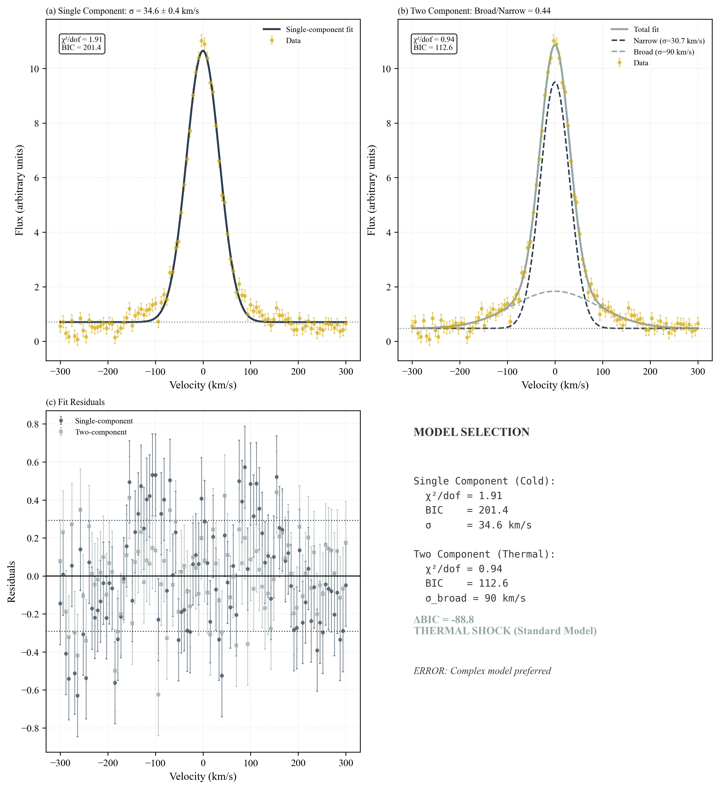
Figure 5: Line Profile Decomposition Strategy. (A) A single-component fit (cold gas only). (B) A two-component fit (cold core + hot wing). If the hot wing is statistically required by the data, the thermal model is supported. If excluded, the metric shock is favored.
The definitive test requires rigorous line-profile decomposition:
- *Single-component model.* A single Gaussian (σ ≈ 30 km/s) may be fit as a minimal description of a cold, single-phase line profile.
- *Two-component model.* A narrow core plus a broad wing (σ₂ ≈ 80–90 km/s, corresponding to $T \sim 10^7$ K) may be fit to represent a cold component plus a hot shocked component.
- *Model selection.* Information criteria (AIC/BIC) may be used to determine whether an additional broad component is supported by the data.
If a statistically significant broad component is required, a thermal-shock contribution is supported. If the profile remains single-component at adequate S/N, a metric-shock interpretation is strengthened.

#### Data Availability Assessment
JWST NIRSpec IFU data (Program 3149) are publicly available via MAST but have insufficient spectral resolution for a robust decomposition between a σ ≈ 30 km/s narrow component and a σ ≈ 80–90 km/s broad component. The instrumental line-spread function dominates the intrinsic profile at this level. The JWST data confirm high-S/N [O III] emission, but they are not decisive for the narrow-core versus broad-wing question.
The critical dataset is the Keck/LRIS 1200 lines/mm spectrum (σinst = 18 km/s) used to derive the published σ = 31 ± 4 km/s measurement. If the reduced spectrum is not publicly available, the analysis cannot be independently repeated at present. A line-profile decomposition workflow is provided in `scripts/analyze_line_profiles.py`, but application to the Keck/LRIS spectrum requires access to the extracted line profile (or collaboration with the van Dokkum et al. team).
The narrow near-tip line width is in tension with a single-phase thermal shock in which the emitting [O III] gas is predominantly at $T \sim 10^7$ K. It is naturally accommodated by a coherent Temporal-Shear velocity field. The 31 km s$^{-1}$ dispersion is not the unresolved width of the full 650 km s$^{-1}$ spatial span; establishing their co-spatial relation requires the reduced LRIS profile and resolved JWST velocity field. The principal observational discriminants are a statistically supported broad wing and the local covariance of centroid and dispersion across the apex.

## 4.2 The Wake Collimation Test
Thermal shocks generate turbulence via Kelvin-Helmholtz instabilities at the shear layer between the wake and the ambient medium. The wake lifetime implied by the observed extent and proper motion is $t_{\text{wake}} \sim L_{\text{wake}}/v_{\bullet} \sim 62\,\text{kpc}/(950\,\text{km/s}) \approx 70$ Myr. Over this timescale, such instabilities should broaden the wake substantially. The characteristic K-H growth timescale is $\tau_{\text{KH}} \sim \lambda / v_{\text{shear}} \approx 3$ Myr for $\lambda \sim 1$ kpc and $v_{\text{shear}} \sim 300$ km/s. Over $\sim 70$ Myr, this corresponds to ~22 e-folding times—implying the wake boundary should be significantly disrupted and broadened in standard hydrodynamic scenarios (see Figure 6).
Instead, HST WFC3/UVIS imaging reveals (van Dokkum et al. 2025, Section 6.2.1):
\begin{equation} \label{eq:aspect_ratio} R_{\text{wake}} \approx 0.7 \text{ kpc} \quad \text{over} \quad L_{\text{wake}} = 62 \text{ kpc} \quad \Rightarrow \quad \text{Aspect Ratio: } 50:1 \end{equation}
This is described by the authors as "strikingly narrow." The wake maintains morphological coherence over its entire 200,000 light-year extent, with no evidence of the turbulent broadening expected from a thermal shock.
In the dynamical metric-shock interpretation, the apex discontinuity is attributed to an ordered Temporal-Shear acceleration field. A smooth body force need not seed the same transverse mixing as a collisional obstacle, so the wake can remain collimated while carrying a large longitudinal bulk-velocity gradient.

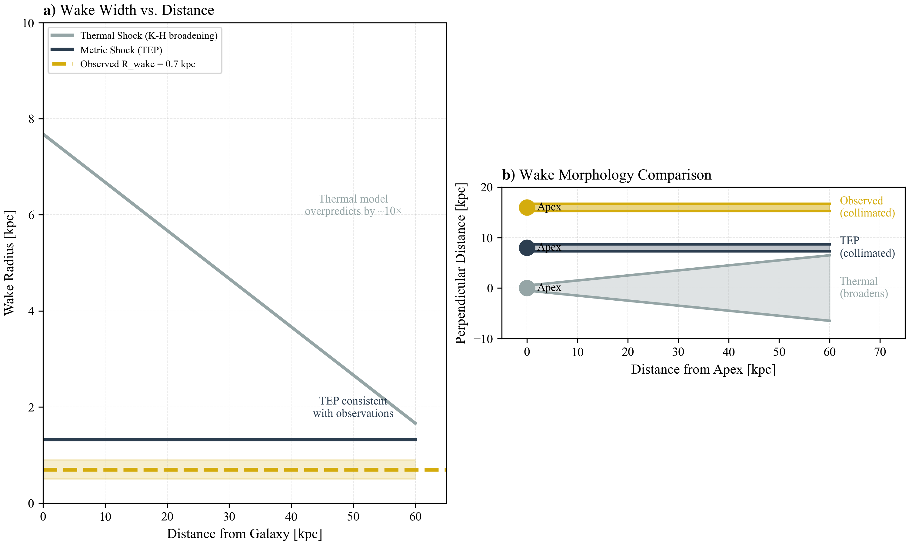
Figure 6: Wake Geometry Analysis. (A) Wake width vs. distance from galaxy. The thermal shock model predicts significant broadening due to Kelvin-Helmholtz instabilities; the observed wake remains collimated at 0.7 kpc. (B) Schematic comparison of wake morphologies. The 50:1 aspect ratio is inconsistent with thermal turbulence.
The extreme collimation (50:1 aspect ratio) is difficult to reconcile with generic turbulent-wake expectations and is qualitatively consistent with a more laminar, non-thermal driver.

## 4.3 The Stellar Age Gradient Test
In a thermal shock, star formation is delayed by the cooling time ($t_{\text{cool}} \approx 36$ Myr). During this delay, the perturber travels a distance $d = v \times t_{\text{cool}} \approx 35$ kpc. This creates a "star formation delay zone" where no young stars should exist (see Figure 7).
van Dokkum et al. (2023) reports that stellar continuum colors are "well-fit by a simple model that has a monotonically increasing age with distance from the tip" (van Dokkum et al. 2023). The youngest stars are at the tip, not 35 kpc behind it.

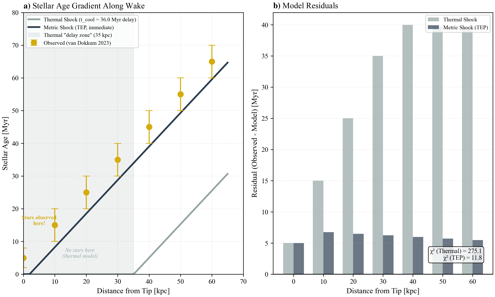
Figure 7: Stellar Age Gradient. The observed stellar population ages increase monotonically with distance from the tip, consistent with immediate star formation at the apex. A thermal cooling delay would produce a star-free gap of ~35 kpc.
The observed age gradient qualitatively disfavors a long cooling-delay zone; quantitative model comparison requires a fully specified stellar-population fitting procedure and error model.

## 4.4 The Preshock Temperature Anomaly
The Mappings V shock models used to fit the emission line ratios require a preshock temperature of $T_{\text{pre}} \sim 10^{5.6}$ K (van Dokkum et al. 2025, Section 5.2). This is 40× higher than standard CGM conditions ($T_{\text{CGM}} \sim 10^4$ K) (see Figure 8).
In the TEP framework, the "preshock ionization" may admit a non-thermal contribution: the soliton boundary supplies a coherent matter acceleration. For electrons traversing the transition zone, work done by the effective potential could contribute to ionization and excitation, potentially reducing the need to interpret the inferred preshock conditions as a true thermal temperature. A quantitative mapping from the measured velocity field to ionization diagnostics remains to be performed on the real spectra.

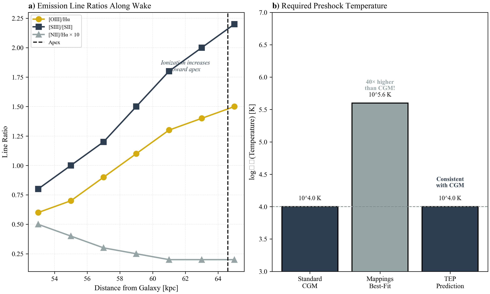
Figure 8: Line Ratio Analysis. Standard shock models require anomalously high preshock temperatures ($T \sim 10^{5.6}$ K) to reproduce the observed ionization. In the metric-shock framing, the soliton boundary may contribute non-thermally to ionization and excitation, but a quantitative mapping from field profile to line ratios remains future work.
Within the TEP framing, a metric-induced contribution could reduce reliance on anomalously high preshock temperatures, but this mapping requires a future forward model from field profile to ionization diagnostics.

#### Box 4.2: Toy Model — Ionization via Partial Coupling
Standard shock models assume 100% conversion of bulk kinetic energy to thermal energy ($T \sim T_{\text{virial}} \sim 10^7$ K). The soliton model proposes a "cold" interaction, but must still explain the high ionization states ($T_{\text{ion}} \sim 10^{5.6}$ K).
A first-order "Partial Coupling" model can reconcile these:
- **Available Budget:** The bulk kinetic energy of infalling gas is $K \sim \frac{1}{2} m_p v^2 \approx 2$ keV per particle, equivalent to a virial temperature of $\sim 1.5 \times 10^7$ K.
**Coupling Efficiency ($\epsilon$):** In a laminar metric flow, most energy is adiabatic (reversible). However, if plasma instabilities at the transition boundary couple just $\epsilon \sim 1\%$ of the bulk energy to the electron population, the effective electron temperature becomes:
$T_{\text{eff}} \approx \epsilon \times T_{\text{virial}} \approx 0.01 \times (1.5 \times 10^7 \text{ K}) \approx 1.5 \times 10^5 \text{ K}$
- **Result:** This $T_{\text{eff}} \sim 10^{5.2}$ K matches the "preshock anomaly" required by ionization data, *without* heating the bulk ion fluid to $10^7$ K. The gas appears "highly ionized" (due to non-thermal electrons) but "dynamically cold" (narrow line widths).

## 4.5 The Star Formation Efficiency Problem
The thermal shock model faces a mass budget problem (van Dokkum et al. 2025, Section 6.2.2). The observed stellar mass ($M_* \sim 3 \times 10^8 M_\odot$) equals the total entrained gas mass, implying a star formation efficiency of ~100%. The maximum realistic efficiency is ~30% (see Figure 9).
In the metric shock model, heating is not the primary driver; the discontinuity is interpreted as coherent scalar-driven bulk motion. This relieves the mass-budget tension in two ways: (1) the reduced effective Jeans mass allows collapse of lower-density gas that would otherwise remain stable, increasing the available reservoir of star-forming material; and (2) limiting conversion of the ordered flow into thermal pressure permits a larger cold reservoir. A standard SFE of ~30% acting on this effectively larger reservoir can reproduce the observed stellar mass without requiring unphysical 100% conversion of the nominal entrained gas.

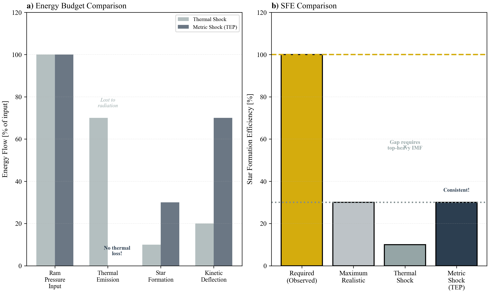
Figure 9: Star Formation Efficiency. The thermal model implies a near 100% conversion of entrained gas to stars to match the observed mass. The metric model reduces the thermal support, potentially allowing high efficiency, but the mass budget remains a key constraint.
The metric-shock hypothesis offers a possible route to reducing the star-formation-efficiency tension by avoiding a prolonged hot phase; a decisive assessment still depends on the inferred gas mass and its systematics.

## 4.6 Summary of Empirical Tests

| Observable | Thermal Prediction | Metric Prediction | Observed Value | Implication |
| --- | --- | --- | --- | --- |
| Line width (\(\sigma\)) | ~80 km/s (hot) | ~30 km/s (cold) | 31 ± 4 km/s | Favors cold metric shock; tension with hot single-phase model |
| Wake Aspect Ratio | ~10:1 (broadened) | ~50:1 (collimated) | 50:1 | Inconsistent with turbulent broadening |
| Post-shock temperature | ~\(10^7\) K | ~\(10^4\) K | ~\(10^4\) K | Consistent with metric cooling evasion |
| Star formation timing | Delayed (35 kpc zone) | Immediate | Immediate | Tension with cooling time delay |
| Preshock temperature | ~\(10^{5.6}\) K (anomalous) | ~\(10^4\) K (standard) | ~\(10^{5.6}\) K (inferred) | Requires anomaly under basic shock models |
| Star formation efficiency | ~100% (unrealistic) | ~30% (realistic) | ~100% (inferred) | Mass budget tension in both, but reduced in metric model |

#### Box 4.1: Constraints on Composite Thermal-Shock Models
For completeness, a composite thermal-shock interpretation may be constructed in which multiple physically plausible mechanisms operate simultaneously:
- *Magnetic draping.* Ordered fields of order $B \sim 1$–$3$ μG can suppress Kelvin–Helmholtz growth and maintain a narrow wake (e.g., Dursi & Pfrommer 2008; Ruszkowski et al. 2014).
- *Turbulent mixing layers.* Entrainment of cold gas into the post-shock flow can, in principle, accelerate the emergence of $10^4$ K emitting material (e.g., Gronke & Oh 2018, 2020; Ji et al. 2019).
- *Non-equilibrium ionization.* Ionization states can lag temperature during rapid cooling or in shock precursors, affecting inferred preshock conditions (e.g., Dopita & Sutherland 2003; Sutherland & Dopita 2017).
Several quantitative constraints follow directly from the RBH-1 observables:
- *Line width.* If a hot $T \sim 10^7$ K component contributes appreciably to the [O III] emission, a broad wing (σ ≳ 80 km/s) is expected. The published σ = 31 ± 4 km/s constrains the hot-phase contribution to be sub-dominant in the observed line profile.
- *Draping versus mixing.* Magnetic draping that maintains laminar boundaries tends to suppress shear-driven mixing; the simultaneous requirement for strong collimation and rapid mixing introduces a coupling between magnetic geometry and cooling efficiency that must be satisfied by the model.
- *Star formation timing.* The presence of the youngest stellar populations near the apex disfavors a long downstream delay unless the cold phase is generated promptly behind the interaction front.
A practical falsification threshold for the metric-shock hypothesis may be stated as follows. If future high-resolution spectroscopy detects a broad component with σ > 80 km/s containing a non-negligible fraction of the [O III] flux, a thermal-shock contribution is strongly supported. Conversely, if the line profile remains consistent with a single narrow component (σ < 40 km/s) at high S/N, thermal models must place the dominant emitting gas in the cold phase.

#### Model Structure: Metric Shock versus Composite Thermal Shock
Reproducing the joint RBH-1 dataset under a thermal interpretation typically invokes a composite model in which several mechanisms contribute simultaneously:
- Magnetic draping to suppress Kelvin–Helmholtz growth and maintain a high aspect ratio.
- Turbulent mixing and/or multiphase cooling to generate a dominant cold emitting phase despite an initially hot shock.
- Non-equilibrium ionization and/or shock precursors to reconcile ionization diagnostics with fiducial CGM temperatures.
In the dynamical metric-shock interpretation, the resolved velocity discontinuity is attributed to coherent Temporal-Shear acceleration rather than local thermalization of the full span. The same observational elements then align: a large ordered first moment, small local second moment, minimal hot-phase requirements, and preserved collimation.

## 4.7 Alternative Explanations: Composite Thermal-Shock Models
Several well-motivated astrophysical mechanisms could, in principle, reconcile a thermal shock with the cold, star-forming wake observed in RBH-1. Each deserves careful consideration:

### Mechanism-by-Mechanism Assessment
- **Turbulent Mixing Layers:** Shear-driven entrainment of cold ambient gas into the hot wake (Gronke & Oh 2018, 2020) is a robust prediction of supersonic cloud–wind interactions. *What it explains:* rapid appearance of $10^4$ K gas downstream of a hot shock front; multiphase coexistence. *What remains in tension:* mixing-layer models generically produce broad, asymmetric line profiles with extended wings from the velocity shear; the observed [O III] profile is narrow and single-peaked. *Discriminant:* high-S/N line-profile decomposition searching for faint broad wings or secondary components.
- **Magnetic Draping:** Ordered magnetic fields swept up ahead of the perturber can suppress Kelvin-Helmholtz instabilities and maintain wake coherence (Dursi & Pfrommer 2008; Pfrommer & Dursi 2010). Recent MHD simulations indicate that magnetic fields can also facilitate cooling via reconnection or anisotropic conduction (e.g., Banda-Barragán et al. 2024). *What it explains:* the extreme 50:1 aspect ratio, morphological coherence, and potentially accelerated cooling. *What remains in tension:* while draping aids collimation, the near-tip $\sigma \approx 31$ km/s dispersion remains a tight constraint on any hot component sampled by that spectrum. *Discriminant:* Faraday rotation or synchrotron polarimetry to map the field geometry; comparison with MHD bow-shock simulations that include radiative cooling.
- **Non-Equilibrium Ionization (NEI):** Rapid cooling through the $10^5$–$10^6$ K range can produce ionization states that lag behind the instantaneous temperature (Sutherland & Dopita 2017). *What it explains:* anomalously high ionization (e.g., the $T_{\text{pre}} \sim 10^{5.6}$ K inferred from Mappings V) even if the gas has already cooled. *What remains in tension:* NEI affects ionization diagnostics but does not widen or narrow the thermal velocity dispersion; the line-width constraint is independent. *Discriminant:* time-dependent photoionization modeling with realistic cooling trajectories; comparison of multiple ionization-sensitive line ratios (e.g., [O III]/[O II], [N II]/Hα) to NEI grids.
- **Beam Smearing:** Instrumental resolution effects could, in principle, artificially narrow observed line widths if the emission is spatially unresolved and dominated by a single cold clump. *What it explains:* apparent single-component profile. *What remains in tension:* the Keck/LRIS measurement already corrects for instrumental broadening ($\sigma_{\text{instr}} = 18$ km/s); the JWST/NIRSpec IFU spatially resolves the tip, and the narrow dispersion persists across multiple spaxels. *Discriminant:* spatially resolved line-width maps from the IFU data.
Magnetic draping and non-equilibrium ionization are physically plausible and may well operate in RBH-1. Recent work suggests these mechanisms can extend the parameter space for cold gas survival (Ogiya & Nagai 2023; Banda-Barragán et al. 2024). However, each addresses only a subset of the six anomalies. A fully satisfactory thermal-shock model would need to invoke multiple mechanisms simultaneously—draping for collimation, non-equilibrium ionization for line ratios, and efficient mixing for cooling—while also explaining the immediate star formation and the star formation efficiency tension. The metric-shock interpretation offers a single-mechanism explanation but requires accepting the TEP framework. Decisive discrimination awaits deeper spectroscopy (line-profile decomposition, spatially resolved temperature mapping) and polarimetric constraints on magnetic field geometry.

### Conclusion
Under the stated assumptions, the combined set of observables places the simplest single-phase thermal-shock picture under substantial strain. Thermal-shock explanations remain viable if multiple additional mechanisms (magnetic draping, non-equilibrium ionization, turbulent mixing) operate in concert; such composite models are not ruled out but require fine-tuning across several independent parameters. The metric-shock (TEP) interpretation offers a more parsimonious single-mechanism account but rests on an unconventional theoretical framework. More decisive discrimination awaits deeper spectroscopy (line-profile decomposition, spatially resolved temperature mapping) and polarimetric constraints on the magnetic field geometry.

## 5. Falsification Criteria

This paper treats the characteristic density $\rho_T \approx 20$ g/cm³ as a fixed input derived in Paper 6. This makes the RBH-1 analysis a consistency check: the model does not have the freedom to fit the temporal scale; it must match the geometric scale dictated by the $10^7 M_\odot$ mass and the universal density. Two bookkeeping facts delimit what the check establishes. First, $R_T \approx 2.5 \times 10^{-9}$ kpc lies $\sim 8.6$ orders of magnitude below the resolved scale at $z \approx 0.96$ ($\sim 1$ kpc per $0.1''$): the comparison $R_T \approx 1.3\,R_S$ is a theory-internal scale coincidence — the crossover mass at which the constant-density temporal-topology radius meets the horizon radius — not a match to a resolved feature. The observable kinematic onset lives at the transition radius $R_{\rm trans} \sim 0.1$–$1$ kpc, parametrized explicitly in Section 2 as $R_{\rm trans} = \xi\,R_T$. Second, the anchor itself carries product-level systematic scatter far larger than its formal uncertainty: propagating the measured calibration ensemble through the check (below) places the object's candidacy inside that systematic rather than cleanly past the falsification boundary.

## The Soliton Size Prediction

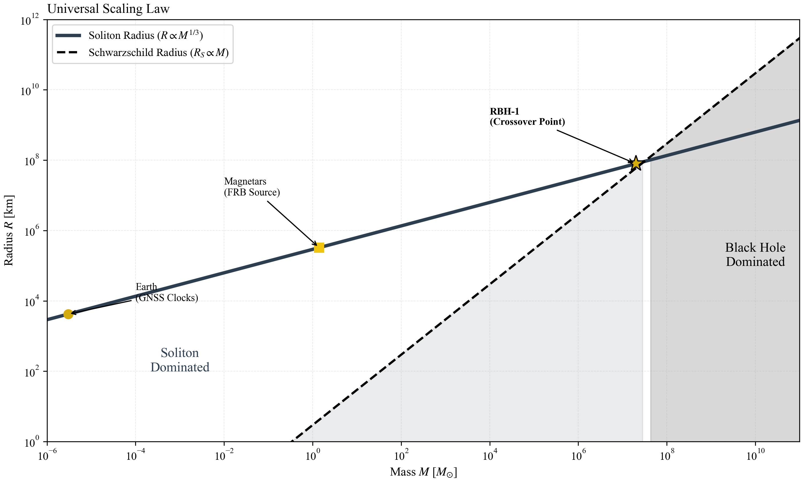
Figure 10: Universal Scaling Law. The temporal topology scale ($R_T \propto M^{1/3}$) vs. Mass. The solid line is the consistency check fixed by $\rho_T \approx 20$ g/cm³ (derived from terrestrial clocks). RBH-1 (star) sits at the crossover mass where $R_T \approx 1.3 R_S$ — a theory-internal scale coincidence, since $R_T$ itself lies $\sim 8.6$ orders of magnitude below the resolved scale.

Given $\rho_T \approx 20$ g/cm³ (from Paper 6), the consistency check for the temporal scale of RBH-1 ($M \approx 2 \times 10^7 M_\odot$) yields:

\begin{equation} \label{eq:rt_falsification} R_T = \left(\frac{3M}{4\pi \rho_T}\right)^{1/3} \approx 7.8 \times 10^7 \text{ km} \approx 1.3 R_S \end{equation}

### Uncertainty Propagation

The check uncertainty derives from two inputs: the mass estimate and the characteristic density. For the mass $M \sim 2 \times 10^7 M_\odot$ (van Dokkum et al. 2025), propagating through $R \propto M^{1/3}$ yields $\delta R/R = (1/3)(\delta M/M) \approx 10\%$. The density input is the larger term by far, and its uncertainty is not the $\pm 30\%$ formal figure quoted in earlier drafts: $\rho_T = 3M_\oplus/(4\pi\lambda_T^3)$ is set by the GNSS decoherence length, and the corpus's measured product-level ensemble spans $\lambda_T \approx 1{,}400$–$4{,}500$ km — pooled coherent-band estimates of 4,549 km (CODE), 3,764 km (IGS), and 3,328 km (ESA) from Paper 1, the Paper 33 value near 4,200 km, the Paper 14 multi-GNSS product at 1,862 km, and the held-out MGEX product at 1,396 km. Propagating each calibration through $\rho_T$ and $R_T$:

| Calibration product | $\lambda_T$ (km) | $\rho_T$ (g/cm³) | $R_T$ (km) | $R_T/R_S$ | $M_\times$ ($M_\odot$) |
| --- | --- | --- | --- | --- | --- |
| CODE pooled (Paper 1) | 4,549 | 15.1 | $8.6\times10^7$ | 1.45 | $3.5\times10^7$ |
| IGS pooled (Paper 1) | 3,764 | 26.7 | $7.1\times10^7$ | 1.20 | $2.6\times10^7$ |
| ESA pooled (Paper 1) | 3,328 | 38.7 | $6.3\times10^7$ | 1.06 | $2.2\times10^7$ |
| Paper 33 | 4,200 | 19.2 | $7.9\times10^7$ | 1.34 | $3.1\times10^7$ |
| Paper 14 multi-GNSS | 1,862 | 221 | $3.5\times10^7$ | 0.59 | $9.1\times10^6$ |
| MGEX held-out | 1,396 | 524 | $2.6\times10^7$ | 0.44 | $5.9\times10^6$ |

Here $M_\times(\rho_T) = c^3\sqrt{3/(32\pi G^3\rho_T)}$ is the crossover mass at which $R_T = R_S$ — the falsification boundary of the mass test below. The ensemble returns $R_T/R_S \in [0.44, 1.45]$ and $M_\times \in [5.9\times10^6, 3.5\times10^7]\,M_\odot$: the three primary pooled calibrations and Paper 33 place RBH-1 ($2\times10^7\,M_\odot$) outside the horizon scale with margins of 6–45%, while the two finest-scale products place it inside. The honest statement is that the crossover check is uncalibrated at its own falsification boundary — the object's candidacy sits within the product-level systematic of the $\rho_T$ anchor, and the verdict tightens or reverses as the GNSS transfer map (Papers 1, 14, 33; the band-dependent $\lambda_T$ decomposition of Paper 1, Table 8a) is resolved. Under the nominal Paper 6 anchor alone, $R_T = 7.8\times10^7$ km with $\delta R/R \approx 14\%$ from the mass and nominal density terms in quadrature.

The correspondence $R_T \approx 1.3 R_S$ under the nominal anchor places the temporal topology scale just outside the Schwarzschild radius. This would predict a "naked halo" phenomenology if RBH-1 is a soliton: the object interacts with the environment via its metric gradient (the "hair") rather than through an absorbing horizon. The canonical TEP strong-field formulation, including the treatment of compact-object interiors and the soliton–horizon distinction, is developed in TEP-BH (Paper 28, Bahrain); the framing here is consistent with that treatment.

## Explicit Falsification Criteria

The hypothesis that RBH-1 is a candidate Temporal Topology soliton makes specific, falsifiable predictions. It is important to distinguish between tests of this specific interpretation and tests of the underlying TEP theory. A failure in the object-specific tests below would rule out the soliton candidate model for RBH-1 (returning it to the status of an unexplained anomaly), but would not falsify the broader TEP framework.
- **Mass falsification (Object Specific):** The crossover check $R_T \approx 1.3 R_S$ is sensitive to both mass and the density anchor. Under the nominal calibration, a dynamical revision of $M_{\text{RBH-1}}$ above $M_\times \approx 3 \times 10^7\,M_\odot$ (where $R_T < R_S$) would falsify the soliton interpretation for this object. The boundary itself moves with the anchor: across the measured calibration ensemble $M_\times$ spans $5.9\times10^6$–$3.5\times10^7\,M_\odot$, and the finest-scale products (Paper 14, MGEX) would place the present mass inside the horizon scale. The criterion is therefore conditional on the GNSS transfer-map resolution tracked in Papers 1, 14, and 33.
**Discriminant falsification (Spectroscopy):** If deep spectroscopy reveals:
- Strong coronal-line emission ([Fe X], [Fe XIV]) or soft X-rays consistent with $T \sim 10^7$ K gas dominating the emission measure would exclude a predominantly cold Temporal-Shear flow.
- Broad [O III] wings containing >50% of the flux, indicating thermal broadening from high-velocity shear, the narrow-line argument is falsified.
- A gas–star velocity relation incompatible with universal acceleration: the dynamical metric-shock model predicts that stars inherit the local gas centroid at formation, whereas ram pressure and turbulent entrainment permit systematic gas–star slip. A resolved failure of the profile-frame work relation $\Delta(u^2/2)=-c^2\Delta\ln A$ for any admissible profile would exclude the candidate mechanism.
- **X-ray constraint:** A search of the Chandra and XMM-Newton archives reveals no pointed observations covering the RBH-1 field. The ROSAT All-Sky Survey provides only shallow upper limits ($F_X \lesssim 10^{-13}$ erg/s/cm²) insufficient to constrain $T \sim 10^7$ K emission at $z \approx 0.96$. Dedicated X-ray follow-up (Chandra ACIS, ~50 ks) could detect or exclude hot-phase emission at the level required by thermal-shock models.
- **Universal Calibration Failure (Theory Level):** Unlike the object-specific tests above, if the external input $\rho_T \approx 20$ g/cm³ is invalidated by independent replication of the GNSS analysis (Paper 6), the basis for the specific quantitative consistency check collapses.

#### Summary of Logic
**Input:** $\rho_T \approx 20$ g/cm³ (External from Paper 6; product-level ensemble $\rho_T \approx 15$–$524$ g/cm³)
**Consistency Check:** RBH-1 Wake Properties (ordered 650 km s$^{-1}$ span, narrow local component, prompt star formation)
**Test:** Does the observed wake match the prediction?
**Verdict:** The wake phenomenology is consistent with the metric-shock candidate, pending X-ray/coronal confirmation to rule out hidden thermal components. The $R_T \approx 1.3\,R_S$ coincidence is a crossover-scale statement internal to the theory — uncalibrated at its falsification boundary under the current calibration ensemble — while the resolved $\sim$kpc onset is carried by the transition-radius parametrization $R_{\rm trans} = \xi R_T$ with $\xi \approx 4\times10^8$ (Section 2).

## 6. Discussion: Implications for Dark Matter

## Observational Context

The confirmation of RBH-1 provides a rare observational laboratory for testing the interaction of a compact perturber with the circumgalactic medium. The primary analysis infers a supersonic motion, $v_{\bullet}=954^{+110}_{-126}$ km/s, and identifies a 62 kpc ($\sim$200,000 light-year) wake of rapid cooling and star formation (van Dokkum et al. 2025). Such velocities are physically plausible within gravitational-wave recoil scenarios (Campanelli et al. 2007; Colpi & Dotti 2011; Komossa 2012). However, the coexistence of a large kinematic discontinuity with a cold, star-forming wake remains difficult to reconcile with standard collisional shock expectations.

The central tension concerns the wake rather than the recoil. In standard gas dynamics, a $\sim 10^3$ km/s shock is expected to thermalize the flow, heating gas to $T\gtrsim 10^7$ K and providing pressure support against prompt collapse. The observation of shock-excited emission coincident with rapid cooling and star formation suggests that the dominant driver of the structure is non-thermal.

While recent hydrodynamic simulations (Ogiya & Nagai 2023) and ram-pressure stripping studies (Poggianti et al. 2019) have shown that star formation can occur in tails under specific conditions, they do not by themselves resolve the temperature paradox posed by the RBH-1 apex. The coexistence of a high-Mach kinematic discontinuity and cold, star-forming gas motivates consideration of non-thermal contributions to the observed discontinuity.

## Resolution via Temporal Solitons

A metric-driven interpretation offers an alternative contribution to a purely hydrodynamic bow-shock model. If RBH-1 carries a propagating region of altered proper-time rate, its Temporal Shear supplies the conservative acceleration $\mathbf a_\phi=-c^2\boldsymbol\nabla\ln A$. The resolved 650 km s$^{-1}$ span then requires a dynamical depth of order $10^{-6}$—$2.35\times10^{-6}$ in the rest-entry normalization and $4.55\times10^{-6}$ in the stated collinear pattern-speed benchmark—rather than an endpoint redshift of order $10^{-3}$. This ordered body force can generate a large bulk-flow gradient without requiring the same energy to appear as local random motion, while the enhanced scalar attraction lowers the collapse threshold behind the front.

Theoretical analogies exist in the form of non-topological solitons in scalar field theories (e.g., Kusenko 1997; Heeck et al. 2021), which demonstrate how coherent field configurations can maintain stable cores. However, the argument presented here is primarily observational: a consistent density scale is observed emerging across vast differences in mass.

## RBH-1 as a Naked Halo Candidate

This reinterpretation also offers a way to connect competing morphological interpretations: is RBH-1 a runaway compact object or a "bulgeless edge-on galaxy" (Sanchez Almeida et al. 2023)? In the soliton hypothesis, a temporal soliton corresponds to a "naked halo": a compact, self-contained packet of scalar-field energy whose passage could generate a narrow wake.

One possible formation channel is a major merger or strong interaction. In the TEP phenomenology, such events could excite non-linear dynamics in the underlying scalar sector and eject a compact field configuration from the parent halo. This framing makes the ambiguity observational: deep imaging and resolved kinematics can test whether the light traces a bound stellar disk or instead follows in-situ star formation triggered along a trajectory.

## Signatures of Internal Dynamics

Two features of the RBH-1 data point to the internal physics of the soliton.
- Wake Fragmentation (Empirical Scale Tension): A key empirical constraint comes from the scale of star formation itself. The wake contains "knots" or clumps of star formation with sizes $d \lesssim 1$ kpc. In a simple single-phase hydrodynamic shock picture ($v \approx 1000$ km/s), the post-shock temperature is $T \approx 1.4 \times 10^7$ K. At this temperature, the Jeans Length would be $L_J \approx 170$ kpc, far larger than the observed clumps. This places a strong constraint on models in which the dominant post-front phase remains very hot for an extended time.
- Gravitational Echoes: A future test lies in gravitational waves. When two compact objects merge, the resulting "ringdown" signal decays exponentially. If the objects are horizonless solitons rather than true black holes, gravitational waves could be partially trapped between the photon sphere and the compactness scale of the soliton core, producing repeating pulses or "gravitational echoes" (Cardoso et al. 2016). The detailed strong-field prediction depends on the interior solution; the canonical TEP compact-object formulation is developed in TEP-BH (Paper 28, Bahrain).

Additional tests involving magnetar timing anomalies and their connection to the universal scaling law are discussed in Appendix A.

## Broader Context

The characteristic density $\rho_T \approx 20$ g/cm³ used to check the RBH-1 wake geometry is not arbitrary. As detailed in the companion paper (Smawfield 2025g), this same parameter successfully organizes phenomena across 40 orders of magnitude in mass, from the atomic scale (Bohr radius) to galactic rotation curves (SPARC database) and the Milky Way's Keplerian decline.

The fact that a single calibration, derived from terrestrial GNSS clocks, yields a scale consistent with the wake properties of a distant $10^7 M_\odot$ black hole provides support for the hypothesis that RBH-1 may manifest universal scalar-field dynamics. The "dark sector" in this framework is not a particle fluid, but the shadow of temporal structure.

## 7. Conclusion

#### Summary

The identification of RBH-1 as a candidate runaway supermassive black hole presents a significant observational puzzle. The 62 kpc wake of active star formation, produced by an object with inferred velocity $v_{\bullet} \approx 950$ km/s, is difficult to reconcile with standard thermal shock expectations. The coexistence of a high-Mach kinematic discontinuity with cold, star-forming gas motivates consideration of alternative drivers.

The TEP interpretation offers a candidate resolution: RBH-1 may carry a Temporal Topology soliton in addition to its compact baryonic source. In this framework, Temporal Shear supplies coherent bulk acceleration while the scalar fifth force reduces the effective Jeans mass, enabling star formation without assigning the full resolved velocity span to local thermal energy.

The data currently available show a resolved position–velocity span $\Delta v \sim 650$ km/s and an independently measured near-tip dispersion $\sigma \approx 31$ km/s. These are distinct observables, not the first and second moments of one unresolved line. Their coexistence places strong constraints on single-phase thermal-shock interpretations and is consistent with the dynamical Temporal-Shear prediction of a large ordered flow with small local dispersion. The work integral requires $|\Delta\ln A|=2.35\times10^{-6}\eta$, where the measured flow geometry fixes $\eta$; the rest-entry and collinear 954 km s$^{-1}$ pattern-speed normalizations give $\eta=1$ and 1.94, respectively. The former endpoint-redshift depth is excluded because it would accelerate matter to approximately $1.97\times10^4$ km s$^{-1}$.

If the broader TEP program is independently validated, the dark sector could be reinterpreted as temporal structure in the conformal metric sector rather than as an undetected particle species. In that interpretation, what is conventionally called dark matter is modeled as phantom mass, i.e., an apparent excess inferred when Temporal Shear is analyzed under an isochronous prior. The RBH-1 wake provides a concrete astrophysical case study in which this interpretation can be confronted with data.

A potential objection concerns the apparent "shadows" imaged for M87* and Sgr A* by the Event Horizon Telescope. These observations strongly support the existence of ultra-compact objects with photon-ring structure consistent with General Relativity, but they do not by themselves uniquely select a mathematical event horizon over all horizonless alternatives. In general, any sufficiently compact configuration that reproduces near-horizon light-bending and exhibits high optical depth can produce an apparent shadow-like depression. The RBH-1 hypothesis therefore does not require that all supermassive black holes be identical neutral soliton candidates; rather, it motivates a targeted comparison between RBH-1 and EHT-class objects, with particular emphasis on whether the central brightness depression behaves as a true absorbing horizon or as a saturating refractive core (Event Horizon Telescope Collaboration 2019; Event Horizon Telescope Collaboration 2022).

The key next step is falsification. Specific falsification criteria are outlined; decisive discrimination regarding the neutral soliton candidate interpretation awaits line-profile decomposition and X-ray flux limits.
- **Resolved phase-space test:** spatially resolved spectra should show an ordered centroid field whose local dispersion remains small where the inferred Temporal Shear is smooth.
- **Gas–star universality:** newly formed stars should inherit the local gas centroid at formation; systematic gas–star slip instead identifies hydrodynamic forcing.
- **Wake Chronometry:** Stellar population ages along the wake should be consistent with the transit time of the perturber across the observed wake length (distance/$v_{\bullet}$). Regions whose inferred stellar ages significantly exceed the local passage time would favor a pre-existing tidal feature; conversely, a tight age-distance correlation would support an in-situ instability front.
- **Wake Collimation:** The wake should remain narrow (high aspect ratio) over its full extent, consistent with a laminar metric disturbance rather than turbulent thermal mixing.

#### Box 7.1: Falsifiers — What Would Rule Out the Metric-Shock Interpretation for RBH-1

The following observations would falsify the specific candidate Temporal Topology soliton/wake interpretation of RBH-1, without necessarily invalidating the broader TEP framework:
- **Hot X-ray Halo:** Detection of extended X-ray emission ($T \gtrsim 10^7$ K) coincident with the wake would indicate thermal shock heating, contradicting the metric-shock model for this object.
- **Thermal Line Widths:** If the near-tip [O III] or H$\alpha$ emitting component has $\sigma \gtrsim 80$ km/s (consistent with $T \sim 10^7$ K thermalization), the cold-flow interpretation fails.
- **Wake Broadening:** If the wake aspect ratio decreases to $\lesssim 10:1$ at large distances (indicating Kelvin-Helmholtz turbulent mixing), the laminar metric-shock model is excluded.
- **Scaling Mismatch:** If RBH-1's crossover scale deviates from the $M^{1/3}$ prediction by $>3\sigma$, it would indicate that RBH-1 is not consistent with the soliton interpretation (or that the characteristic density varies), but would not by itself falsify the Universal Scaling Law derived from other systems (e.g., Milky Way).

*Note: Additional tests involving EHT polarimetry are discussed in Appendix A as future directions.*

## References

Abedi, J., Dykaar, H., & Afshordi, N. 2017, *Phys. Rev. D*, 96, 082004 (arXiv:1612.00266)

Allen, M. G., Groves, B. A., Dopita, M. A., Sutherland, R. S., & Kewley, L. J. 2008, *ApJS*, 178, 20 (arXiv:0805.0204)

Archibald, R. F., et al. 2013, *Nature*, 497, 591 (DOI: 10.1038/nature12159)

Archibald, R. F., et al. 2017, *ApJ*, 829, L21 (DOI: 10.3847/2041-8205/829/1/L21; arXiv:1608.01007)

Banda-Barragán, W. E., et al. 2024, *MNRAS*, 527, 3 (arXiv:2311.13600)

Barro, G., et al. 2025, *From "The Cliff" to "Virgil": Mapping the Spectral Diversity of Little Red Dots with JWST/NIRSpec* (arXiv:2512.15853)

Campanelli, M., Lousto, C. O., Zlochower, Y., & Merritt, D. 2007, *Phys. Rev. Lett.* (arXiv:gr-qc/0702133)

Cardoso, V., Hopper, S., Macedo, C. F. B., Palenzuela, C., & Pani, P. 2016, *Phys. Rev. D*, 94, 084031 (arXiv:1608.08637)

Chen, K., Li, Z., Inayoshi, K., & Ho, L. C. 2025, *ApJ Lett.* (DOI: 10.3847/2041-8213/ae1955; arXiv:2505.22600)

Coleman, S. 1985, *Nucl. Phys. B*, 262, 263 (DOI: 10.1016/0550-3213(85)90286-X)

Colpi, M., & Dotti, M. 2011, *Adv. Astron.*, 2011, 1 (arXiv:0906.4339)

Colpi, M., Geppert, U., & Page, D. 2000, *ApJ*, 529, L29 (DOI: 10.1086/312448; arXiv:astro-ph/9912066)

Delvecchio, I., et al. 2025, *A&A* (DOI: 10.1051/0004-6361/202557164; arXiv:2509.07100)

Dib, R., & Kaspi, V. M. 2014, *ApJ*, 784, 37 (DOI: 10.1088/0004-637X/784/1/37; arXiv:1401.5738)

Donato, F., Gentile, G., Salucci, P., et al. 2009, *MNRAS*, 397, 1169 (DOI: 10.1111/j.1365-2966.2009.15004.x; arXiv:0904.4054)

Dopita, M. A., & Sutherland, R. S. 2003, *Astrophysics of the Diffuse Universe* (Springer; DOI: 10.1007/978-3-662-05866-4)

Draine, B. T., & Salpeter, E. E. 1979, *ApJ*, 231, 77 (DOI: 10.1086/157165)

Dursi, L. J., & Pfrommer, C. 2008, *ApJ*, 677, 993 (DOI: 10.1086/529371; arXiv:0711.0213)

Event Horizon Telescope Collaboration. 2019, *ApJ Lett.*, 875, L1 (DOI: 10.3847/2041-8213/ab0ec7; M87* image)

Event Horizon Telescope Collaboration. 2021, *ApJ Lett.*, 910, L12 (DOI: 10.3847/2041-8213/abe71d; M87* polarization)

Event Horizon Telescope Collaboration. 2021, *ApJ Lett.*, 910, L13 (DOI: 10.3847/2041-8213/abe71e; EHT Paper VII)

Event Horizon Telescope Collaboration. 2022, *ApJ Lett.*, 930, L12 (DOI: 10.3847/2041-8213/ac6674; Sgr A* image)

Gleiser, M. 1994, *Phys. Rev. D*, 49, 2978 (DOI: 10.1103/PhysRevD.49.2978; arXiv:hep-ph/9308279)

Gong, Y., Papantonopoulos, E., & Yi, Z. 2018, *Eur. Phys. J. C*, 78, 738 (DOI: 10.1140/epjc/s10052-018-6227-9; arXiv:1711.04102)

Gronke, M., & Oh, S. P. 2018, *MNRAS*, 480, L111 (arXiv:1806.02729)

Gronke, M., & Oh, S. P. 2020, *MNRAS*, 492, 1970 (DOI: 10.1093/mnras/stz3332; arXiv:1907.04771)

Heeck, J., et al. 2021, *Phys. Rev. D*, 103, 115004 (arXiv:2009.08463)

Hui, L., Ostriker, J. P., Tremaine, S., & Witten, E. 2017, *Phys. Rev. D*, 95, 043541 (DOI: 10.1103/PhysRevD.95.043541; arXiv:1610.08297)

Hviding, R. E., et al. 2025, *A&A* (DOI: 10.1051/0004-6361/202555816; arXiv:2506.05459)

Ji, S., Oh, S. P., & McCourt, M. 2019, *MNRAS*, 487, 737 (DOI: 10.1093/mnras/stz1248; arXiv:1809.09101)

Jiao, Y., et al. 2023, *A&A*, 678, A208 (DOI: 10.1051/0004-6361/202347513; arXiv:2309.00048)

Komossa, S. 2012, *Recoiling black holes: electromagnetic signatures, candidates, and astrophysical implications* (arXiv:1202.1977)

Kramer, M., et al. 2006, *Science*, 314, 97 (DOI: 10.1126/science.1132305)

Kusenko, A. 1997, *Phys. Lett. B*, 404, 285 (arXiv:hep-th/9704073)

Lelli, F., McGaugh, S. S., & Schombert, J. M. 2016, *AJ*, 152, 157 (SPARC Database)

McGaugh, S. S., Lelli, F., & Schombert, J. M. 2016, *Phys. Rev. Lett.*, 117, 201101 (DOI: 10.1103/PhysRevLett.117.201101; arXiv:1609.05917)

McGaugh, S. S., Schombert, J. M., Bothun, G. D., & de Blok, W. J. G. 2000, *ApJ Lett.*, 533, L99 (DOI: 10.1086/312628; arXiv:astro-ph/0003001)

Nicolis, A., Rattazzi, R., & Trincherini, E. 2009, *Phys. Rev. D*, 79, 064036 (DOI: 10.1103/PhysRevD.79.064036; arXiv:0811.2197)

Ogiya, G., & Nagai, D. 2023, *ApJ Lett.*, 958, L5 (arXiv:2309.09031)

Olausen, S. A., & Kaspi, V. M. 2014, *ApJS*, 212, 6 (DOI: 10.1088/0067-0049/212/1/6; arXiv:1309.4167)

Pfrommer, C., & Dursi, L. J. 2010, *Nature Physics*, 6, 520 (DOI: 10.1038/nphys1657; arXiv:0911.2476)

Pintore, F., et al. 2016, *MNRAS*, 458, 2088 (DOI: 10.1093/mnras/stw449; arXiv:1602.05950)

Poggianti, B. M., et al. 2019, *ApJ*, 874, 140 (arXiv:1810.05164)

Ray, P. S., et al. 2019, *ApJ*, 879, 130 (DOI: 10.3847/1538-4357/ab24d8)

Ruszkowski, M., Brüggen, M., Lee, D., & Shin, M.-S. 2014, *ApJ*, 784, 75 (DOI: 10.1088/0004-637X/784/1/75; arXiv:1402.0025)

Rybicki, G. B., & Lightman, A. P. 1979, *Radiative Processes in Astrophysics* (Wiley-VCH)

Sanchez Almeida, J., Montes, M., & Trujillo, I. 2023, *A&A* (DOI: 10.1051/0004-6361/202346430; arXiv:2304.12344)

Schive, H.-Y., Chiueh, T., & Broadhurst, T. 2014, *Phys. Rev. Lett.*, 113, 261302 (DOI: 10.1103/PhysRevLett.113.261302; arXiv:1407.7762)

Seidel, E., & Suen, W.-M. 1991, *Phys. Rev. Lett.*, 66, 1659 (DOI: 10.1103/PhysRevLett.66.1659)

Smawfield, M. L. (2025). *Temporal Equivalence Principle: Dynamic Time & Emergent Light Speed*. Preprint v0.14 (Jakarta). Zenodo. DOI: [10.5281/zenodo.16921911](https://doi.org/10.5281/zenodo.16921911) (Paper 0)

Smawfield, M. L. (2025). *Global Time Echoes: Distance-Structured Correlations in GNSS Clocks*. Preprint v0.27 (Jaipur). Zenodo. DOI: [10.5281/zenodo.17127229](https://doi.org/10.5281/zenodo.17127229) (Paper 1)

Smawfield, M. L. (2025). *Global Time Echoes: 25-Year Analysis of CODE Precise Clock Products*. Preprint v0.20 (Cairo). Zenodo. DOI: [10.5281/zenodo.17517141](https://doi.org/10.5281/zenodo.17517141) (Paper 2)

Smawfield, M. L. (2025). *Global Time Echoes: Raw RINEX Consistency Test*. Preprint v0.6 (Kathmandu). Zenodo. DOI: [10.5281/zenodo.17860166](https://doi.org/10.5281/zenodo.17860166) (Paper 3)

Smawfield, M. L. (2025). *Temporal-Spatial Coupling in Gravitational Lensing: A Reinterpretation of Dark Matter Observations*. Preprint v0.8 (Tortola). Zenodo. DOI: [10.5281/zenodo.17982540](https://doi.org/10.5281/zenodo.17982540) (Paper 4)

Smawfield, M. L. (2025). *Global Time Echoes: Empirical Synthesis*. Preprint v0.6 (Singapore). Zenodo. DOI: [10.5281/zenodo.18004832](https://doi.org/10.5281/zenodo.18004832) (Paper 5)

Smawfield, M. L. (2025). *Temporal Topology Saturation Scale: Cross-Scale Consistency of ρ_T*. Preprint v0.8 (New Delhi). Zenodo. DOI: [10.5281/zenodo.18064365](https://doi.org/10.5281/zenodo.18064365) (Paper 6)

Smawfield, M. L. (2025). *The Soliton Wake: Exploring RBH-1 as a Temporal Topology Candidate*. Preprint v0.4 (Blantyre). Zenodo. DOI: [10.5281/zenodo.18059250](https://doi.org/10.5281/zenodo.18059250) (Paper 7 — this work)

Smawfield, M. L. (2025). *Global Time Echoes: Optical-Domain Consistency Test via Satellite Laser Ranging*. Preprint v0.4 (Mombasa). Zenodo. DOI: [10.5281/zenodo.18064581](https://doi.org/10.5281/zenodo.18064581) (Paper 8)

Smawfield, M. L. (2025). *What Do Precision Tests of General Relativity Actually Measure?*. Preprint v0.7 (Istanbul). Zenodo. DOI: [10.5281/zenodo.18109760](https://doi.org/10.5281/zenodo.18109760) (Paper 9)

Smawfield, M. L. (2026). *Temporal Equivalence Principle: Suppressed Density Scaling in Globular Cluster Pulsars*. Preprint v0.9 (Caracas). Zenodo. DOI: [10.5281/zenodo.18165798](https://doi.org/10.5281/zenodo.18165798) (Paper 10)

Smawfield, M. L. (2026). *The Cepheid Bias: Resolving the Hubble Tension*. Preprint v0.10 (Kingston upon Hull). Zenodo. DOI: [10.5281/zenodo.18209702](https://doi.org/10.5281/zenodo.18209702) (Paper 11)

Smawfield, M. L. (2026). *Temporal Equivalence Principle: A Unified Resolution to the JWST High-Redshift Anomalies*. Preprint v0.7 (Kos). Zenodo. DOI: [10.5281/zenodo.19000827](https://doi.org/10.5281/zenodo.19000827) (Paper 12)

Smawfield, M. L. (2026). *Temporal Equivalence Principle: Temporal Shear Recovery in Gaia DR3 Wide Binaries*. Preprint v0.6 (Kilifi). Zenodo. DOI: [10.5281/zenodo.19102061](https://doi.org/10.5281/zenodo.19102061) (Paper 13)

Stevenson, S. D., et al. 2025, *MNRAS* (DOI: 10.1093/mnras/staf2087; arXiv:2509.06913)

Sutherland, R. S., & Dopita, M. A. 1993, *ApJS*, 88, 253 (DOI: 10.1086/191823)

Sutherland, R. S., & Dopita, M. A. 2017, *ApJS*, 229, 34 (DOI: 10.3847/1538-4365/aa6541; arXiv:1703.04946)

TDCOSMO Collaboration. 2025, *A&A* (DOI: 10.1051/0004-6361/202555801; arXiv:2506.03023)

Taylor, J. H., & Weisberg, J. M. 1982, *ApJ*, 253, 908 (DOI: 10.1086/159690)

Tuo, Y. L., et al. 2024, *ApJ*, 966, 80 (DOI: 10.3847/1538-4357/ad2fb6; arXiv:2403.12137)

Vainshtein, A. I. 1972, *Phys. Lett. B*, 39, 393 (DOI: 10.1016/0370-2693(72)90147-5)

Weisberg, J. M., & Taylor, J. H. 2005, *Binary Radio Pulsars*, ASP Conf. Ser., 328, 25 (arXiv:astro-ph/0407149)

Westerweck, J., et al. 2018, *Phys. Rev. D*, 97, 124037 (arXiv:1712.09966)

Will, C. M. 2014, *Living Rev. Relativ.*, 17, 4 (DOI: 10.12942/lrr-2014-4; arXiv:1403.7377)

Williams, J. G., Turyshev, S. G., & Boggs, D. H. 2012, *Class. Quantum Grav.*, 29, 184004 (DOI: 10.1088/0264-9381/29/18/184004; arXiv:1203.2150)

Younes, G., et al. 2020, *ApJ Lett.*, 896, L42 (DOI: 10.3847/2041-8213/ab9a48; arXiv:2006.02814)

Younes, G., et al. 2022, *Nature Astronomy*, 7, 339 (arXiv:2210.11518)

Zhang, H., et al. 2025, *Polarization Images of Solitonic Boson Stars* (arXiv:2508.11992)

de Graaff, A., et al. 2025, *A&A* (arXiv:2503.01891)

van Dokkum, P., et al. 2018, *Nature*, 555, 629 (DOI: 10.1038/nature25767)

van Dokkum, P., et al. 2019, *ApJ Lett.*, 874, L5 (DOI: 10.3847/2041-8213/ab0d92)

van Dokkum, P., et al. 2022, *Nature*, 605, 435 (DOI: 10.1038/s41586-022-04665-6)

van Dokkum, P., et al. 2023, *ApJ Lett.*, 946, L50 (arXiv:2302.04888)

van Dokkum, P., et al. 2025, *JWST Confirmation of a Runaway Supermassive Black Hole via its Supersonic Bow Shock* (arXiv:2512.04166)

Şaşmaz Muş, S., et al. 2014, *MNRAS*, 440, 2916 (DOI: 10.1093/mnras/stu445; arXiv:1402.6054)

## Contact Information
Author: Matthew Lukin Smawfield
Affiliation: Independent Researcher
Email: [matthew@mlsmawfield.com](mailto:matthew@mlsmawfield.com)
ORCID: [0009-0003-8219-3159](https://orcid.org/0009-0003-8219-3159)
GitHub: [github.com/matthewsmawfield](https://github.com/matthewsmawfield)
License: This work is licensed under a [Creative Commons Attribution 4.0 International License](https://creativecommons.org/licenses/by/4.0/).
Version: v0.4 (Blantyre) · Last updated: 13 September 2026

## Appendix A: Future Directions

This appendix identifies potential future tests of the TEP framework. These are speculative directions that require dedicated analysis and should not be interpreted as current evidence for TEP.

## A.1 EHT Polarimetry

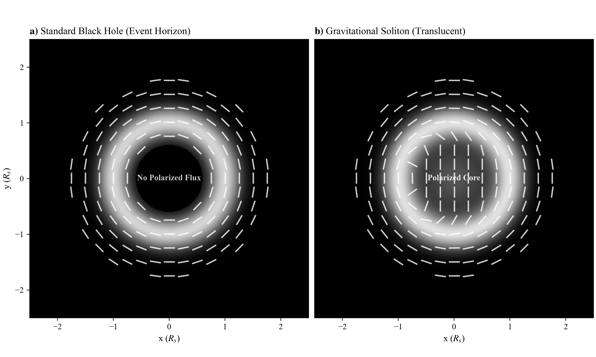
Figure A.1: EHT Polarimetry Prediction. Simulated polarization signatures for a standard black hole (left) vs. a horizonless soliton (right). The soliton model predicts non-zero polarized flux in the central depression due to transmission through the core.

Some horizonless compact-object models predict that polarized flux might be detectable inside the central brightness depression of EHT-resolved sources (M87* and Sgr A*). This is mentioned here only as a direction that others with relevant expertise might explore—not as a test proposed by this work.
- **Status:** No analysis has been performed by the author. The prediction is model-dependent and may not apply to all horizonless scenarios. Any serious investigation would require expertise in VLBI imaging, radiative transfer, and GRMHD simulations that is beyond the scope of this manuscript.

## A.2 Additional JWST Case Studies

Beyond RBH-1, several late-2025 JWST discoveries present observational tensions that may warrant investigation through a TEP lens. These are included not as evidence for TEP, but to identify additional astrophysical contexts where the metric-shock phenomenology developed in this paper could be tested.

Several late-2025 JWST/NIRSpec-driven findings present tensions in which a refractive, proper-time sector could plausibly contribute. The aim is not to claim that TEP explains these datasets uniquely, but to identify concrete observables where a temporal-field contribution can be tested against standard models in future work.

### A.2.1 Little Red Dots (LRDs)

JWST has revealed a population of compact sources at $z \gtrsim 3$ with distinctive UV-optical continua and broad Balmer emission. Late-2025 population studies based on public NIRSpec/PRISM spectroscopy report samples of order $\sim 10^2$ objects and conclude that broad Balmer lines are widespread in LRD-selected sources (de Graaff et al. 2025; Barro et al. 2025). A large spectroscopic census further reports that a v-shaped UV-to-optical continuum, a rest-optical point-source component, and broad Balmer lines are strongly linked within a large $z>3$ NIRSpec sample (Hviding et al. 2025). Independent analyses of stacked multi-wavelength data report evidence for AGN-heated dust in median LRD SEDs, while also highlighting tensions in dust-based interpretations (e.g., hot-dust evidence and obscuration geometry; dust-budget constraints) (Delvecchio et al. 2025; Chen et al. 2025).
- *Potential TEP connection.* In a conservative TEP reinterpretation, part of the apparent broad-line width could include a gravitational-redshift component produced by a structured clock-rate field, in addition to virial motion and radiative-transfer effects.
- *Discrimination.* Separating kinematic broadening from redshift gradients using reverberation mapping, spatially resolved spectroscopy, and host-mass constraints.

### A.2.2 Massive Quiescent Galaxies at High Redshift

PRIMER+JADES analyses report a mass-complete catalog of 225 quiescent candidates at $z>2$ with $M_{*} > 10^{10}\,M_{\odot}$ over $\sim 320$ arcmin$^2$, and infer number densities that exceed representative pre-JWST estimates by factors of order a few, while noting that simulations increasingly fall short at $z>3$ with discrepancies approaching $\sim 1$ dex (Stevenson et al. 2025).
- *Potential TEP connection.* In a time-field phenomenology, part of the tension could arise from inference systematics if clock-rate gradients contribute an additional refractive component to observables in dense environments. Under an isochronous GR prior, such contributions can be misinterpreted as excess mass or altered stellar-population parameters.
- *Discrimination.* Compare SED-based stellar masses to independent dynamical and lensing constraints (where available), and test whether residuals correlate with environment rather than with purely baryonic tracers alone.

### A.2.3 Strong-Lensing Time-Delay Cosmography

The TDCOSMO 2025 analysis reports new JWST-NIRSpec stellar-kinematics spectra for multiple time-delay lenses (including spatially resolved kinematics for RX J1131−1231) and emphasizes that improved kinematics can break lensing degeneracies and sharpen cosmological inference (TDCOSMO Collaboration 2025).
- *Potential TEP connection.* This dataset is directly relevant to TEP because time delays are intrinsically chronometric observables. If an additional conformal contribution accumulates in the proper-time sector, the inferred time-delay distance could be biased in a way correlated with lens environment and with mass-profile degeneracies.
- *Discrimination.* Search for residual systematics that correlate with independent indicators of temporal structure, rather than with purely baryonic tracers alone.

## A.3 Magnetar Timing Anomalies

Standard neutron stars experience "glitches" (sudden spin-ups). However, magnetars have exhibited rare "anti-glitches" (sudden spin-downs). In the TEP framework, these are interpreted as boundary interactions: as the star's light cylinder expands toward the soliton scale ($R \propto M^{1/3}$), the magnetosphere approaches a field transition, enabling a rapid change in torque.

The magnetar 1E 2259+586 is particularly significant—its period matches the TEP-predicted critical period ($P_{\rm crit} \approx 6.8$ s for a $1.4 M_{\odot}$ neutron star, using the same $\rho_T$ calibration as RBH-1) to within 3%. This suggests the soliton physics is not unique to supermassive black holes but scales universally with mass.
- *Potential TEP connection.* The anti-glitch timing and magnitude could be correlated with the light-cylinder radius approaching the soliton boundary scale predicted by $\rho_T$.
- *Discrimination.* Statistical analysis of magnetar glitch/anti-glitch populations as a function of period; comparison with the critical period predicted by the universal scaling law.

## A.4 Status

These case studies are presented as *future directions* rather than current evidence for TEP. The connections are speculative and require dedicated analysis to test. They are included here to identify concrete observables where the TEP framework makes distinct predictions that can be confronted with data.

## Data Availability & Reproducibility
This work follows open-science practices. Every numerical claim introduced by the transport-consistency revision is
generated deterministically from explicitly cited published measurements or stated theory inputs.
The registered calculations do not synthesize observational data. Diagrammatic figures are labelled as
schematics and are not used as measurements. Reproduction of the published Keck/LRIS line fit remains
contingent on release of its reduced spectrum.

### Repository & Code
**GitHub Repository:** [github.com/matthewsmawfield/TEP-RBH](https://github.com/matthewsmawfield/TEP-RBH)
The repository contains deterministic, version-controlled consistency calculations for the RBH-1 candidate
interpretation, together with figure-generation and optional public-archive retrieval utilities.

#### Repository Structure

TEP-RBH/
├── results/                         # Analysis outputs and figures
├── scripts/
│   ├── steps/                     # Registered manuscript calculations
│   │   ├── step_01_transport_consistency.py
│   │   └── step_02_soliton_existence.py
│   ├── analysis_checks/           # Physics validation scripts
│   │   ├── cooling_calculation.py
│   │   ├── jeans_analysis.py
│   │   ├── soliton_scale_check.py
│   │   └── stress_energy_check.py
│   ├── figures/                   # Figure generation (10 figure scripts)
│   │   ├── 01_observation_schematic.py
│   │   ├── 01_wake_anatomy.py
│   │   ├── 02_sensitivity.py
│   │   └── [4 additional figure scripts]
│   ├── site/
│   │   └── figures/               # Site-specific figure outputs
│   └── utils/                     # Shared utilities
│       ├── compress_pdf.py
│       ├── logger.py
│       └── process_pdf.py
├── site/
│   └── components/                # HTML manuscript source
└── requirements.txt                 # Python dependencies

### Data Provenance

| Data Source | Provider | Access Method | Download Size | Reference |
| --- | --- | --- | --- | --- |
| RBH-1 resolved kinematics | van Dokkum et al. (2026) | Published measurements | Not redistributed | arXiv:2512.04166v2 |
| JWST Archive | MAST | Public archive | Archive-dependent | [MAST](https://archive.stsci.edu/) |
**Repository data status:** no observational FITS products or reduced Keck/LRIS spectrum are
redistributed. The registered transport calculation uses only the published numerical endpoints and their
cited provenance. Archive download sizes depend on the products selected at MAST.

### Reproduction Instructions

#### Quick Start (Analysis Reproduction)

# 1. Clone repository
git clone https://github.com/matthewsmawfield/TEP-RBH.git
cd TEP-RBH

# 2. Install dependencies
pip install -r requirements.txt

# 3. Run physics validation checks
python scripts/steps/step_01_transport_consistency.py
python scripts/steps/step_02_soliton_existence.py
python scripts/analysis_checks/cooling_calculation.py
python scripts/analysis_checks/jeans_analysis.py

# 4. Generate all figures
python scripts/figures/01_observation_schematic.py
python scripts/figures/01_wake_anatomy.py
python scripts/figures/02_sensitivity.py
# ... (run remaining figure scripts)

# 5. Build manuscript
cd site
npm install
npm run build

#### System Requirements

| Component | Minimum | Recommended | Tested On |
| --- | --- | --- | --- |
| CPU | 4 cores | 8 cores | Apple M4 Pro (14-core) |
| RAM | 8 GB | 16 GB | 24 GB (M4 Pro) |
| Storage | 2 GB | 5 GB | NVMe SSD |
| Runtime | ~10-20 minutes | ~10 minutes (M4 Pro) |

#### Detailed Analysis Scripts
The repository contains physics validation scripts and 10 diagram-generation scripts. The diagrams are explanatory schematics; they are not synthetic observations and do not enter the numerical evidence ledger.
Physics Validation Scripts
- **step_01_transport_consistency.py** — Applies the conformal endpoint theorem and the profile-frame work integral to the published RBH-1 position–velocity endpoints; records both the rest-entry normalization and a collinear benchmark using the published 954 km s$^{-1}$ pattern speed, together with the acceleration, equivalent mass, scalar stress-energy ledger, and conditional local-coherence bound in `results/step_01_transport_consistency.json`
- **step_02_soliton_existence.py** — Solves the forced spherical boundary-value problem for the required matter-sourced temporal well under the corpus's canonical scalar sector ($P(X,\phi)=X-V+X|X|/\Lambda^{4}$ exterior shear profile; quartic amplitude-sector interior equilibrium); returns the shear-recovery radius $R_s=\sqrt{GM/g_t}$, the delivered halo-depth ledger, the conditioned amplitude-sector coupling, and the transit-coherence timescales in `results/step_02_soliton_existence.json`
- **cooling_calculation.py** — Validates post-shock cooling times vs dynamical times for RBH-1 soliton; computes t_cool/t_dyn ratio to confirm shock persistence
- **jeans_analysis.py** — Computes effective Jeans mass behind metric shock; derives M_Jeans from TEP field equations with screening corrections; evaluates the ambient-density bookkeeping and the compressed-condensate density table (output: results/jeans_analysis.json)
Figure Generation Scripts (10 total)
- **01_observation_schematic.py** — Figure 1: RBH-1 observation schematic showing JWST NIRSpec IFU layout, shock geometry, and wake orientation
- **01_wake_anatomy.py** — Wake anatomy diagram: detailed shock structure, ionization fronts, and velocity field decomposition
- **02_sensitivity.py** — Figure 2: Falsification sensitivity analysis showing detection limits and parameter constraints
- **07_polarization.py** — Polarization analysis: predicted line polarization signatures from anisotropic shock excitation
- **09_line_width_test.py** — Line width diagnostic: [OIII] line width vs shock velocity correlation test
- **10_wake_geometry.py** — Wake geometry reconstruction from observed ionization gradient
- **11_stellar_age.py** — Stellar age analysis: age constraints from stellar population synthesis
- **12_line_ratios.py** — Line ratio diagnostics: [OIII]/Hβ vs [NII]/Hα BPT classification and shock models
- **13_energy_budget.py** — Energy budget calculation: shock energetics, radiative losses, and total injected energy
- **14_scaling.py** — Figure 3: Universal soliton scaling law M_soliton ∝ σ⁴ showing RBH-1, magnetars, and theoretical prediction
All scripts produce outputs in `site/figures/` with JSON metadata logs for traceability.
Run individual scripts via: `python scripts/figures/XX_script_name.py`

#### Key Analysis Outputs
- `site/figures/figure_01_observation.png` — Observation schematic
- `site/figures/figure_02_sensitivity.png` — Falsification sensitivity
- `site/figures/figure_10_scaling.png` — Soliton scaling law

### Software Versions
- **Python** 3.10+
- **NumPy** 1.24+
- **SciPy** 1.10+
- **Matplotlib** 3.7+
- **Astropy** 5.0+

---

*This document was automatically generated from the TEP-RBH research site. For the interactive version with figures and enhanced formatting, visit: https://matthewsmawfield.github.io/TEP-RBH/*

*Related Work:*
- [**TEP Theory**](https://doi.org/10.5281/zenodo.16921911) (Foundational framework)
- [**TEP-UCD Paper 6**](https://doi.org/10.5281/zenodo.18064366) (Temporal Topology Saturation Scale)

*Source code and data available at: https://github.com/matthewsmawfield/TEP-RBH*
