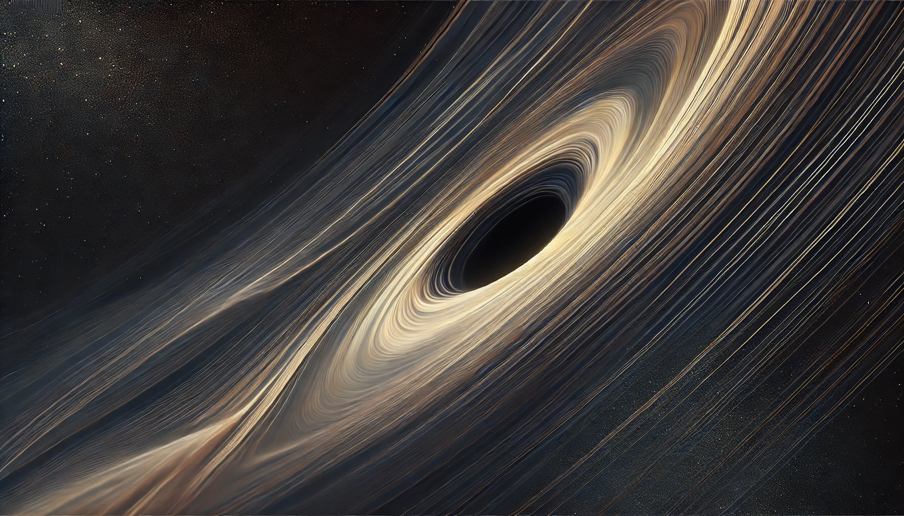

# The Soliton Wake: Identifying the Runaway Object RBH-1 as a Gravitational Soliton

[](https://doi.org/10.5281/zenodo.18059251)
[](https://creativecommons.org/licenses/by/4.0/)



**Author:** Matthew Lukin Smawfield  
**Version:** v0.1 (Blantyre)  
**Date:** 28 December 2025  
**Status:** Preprint  
**DOI:** [10.5281/zenodo.18059251](https://doi.org/10.5281/zenodo.18059251)  
**Website:** [https://matthewsmawfield.github.io/TEP-RBH/](https://matthewsmawfield.github.io/TEP-RBH/)

## The TEP Research Program

| Paper | Repository | Title | DOI |
|-------|-----------|-------|-----|
| **Paper 0** | [TEP](https://github.com/matthewsmawfield/TEP) | Temporal Equivalence Principle: Dynamic Time & Emergent Light Speed | [10.5281/zenodo.16921911](https://doi.org/10.5281/zenodo.16921911) |
| **Paper 1** | [TEP-GNSS](https://github.com/matthewsmawfield/TEP-GNSS) | Global Time Echoes: Distance-Structured Correlations in GNSS Clocks | [10.5281/zenodo.17127229](https://doi.org/10.5281/zenodo.17127229) |
| **Paper 2** | [TEP-GNSS-II](https://github.com/matthewsmawfield/TEP-GNSS-II) | Global Time Echoes: 25-Year Temporal Evolution of Distance-Structured Correlations in GNSS Clocks | [10.5281/zenodo.17517141](https://doi.org/10.5281/zenodo.17517141) |
| **Paper 3** | [TEP-GNSS-RINEX](https://github.com/matthewsmawfield/TEP-GNSS-RINEX) | Global Time Echoes: Raw RINEX Validation of Distance-Structured Correlations in GNSS Clocks | [10.5281/zenodo.17860166](https://doi.org/10.5281/zenodo.17860166) |
| **Paper 4** | [TEP-GL](https://github.com/matthewsmawfield/TEP-GL) | Temporal-Spatial Coupling in Gravitational Lensing: A Reinterpretation of Dark Matter Observations | [10.5281/zenodo.17982540](https://doi.org/10.5281/zenodo.17982540) |
| **Synthesis** | [TEP-GTE](https://github.com/matthewsmawfield/TEP-GTE) | Global Time Echoes: Empirical Validation of the Temporal Equivalence Principle | [10.5281/zenodo.18004832](https://doi.org/10.5281/zenodo.18004832) |
| **Paper 7** | [TEP-UCD](https://github.com/matthewsmawfield/TEP-UCD) | Universal Critical Density: Unifying Atomic, Galactic, and Compact Object Scales | [10.5281/zenodo.18064366](https://doi.org/10.5281/zenodo.18064366) |
| **Paper 8** | **TEP-RBH** (This repo) | The Soliton Wake: A Runaway Black Hole as a Gravitational Soliton | [10.5281/zenodo.18059251](https://doi.org/10.5281/zenodo.18059251) |
| **Paper 9** | [TEP-SLR](https://github.com/matthewsmawfield/TEP-SLR) | Global Time Echoes: Optical Validation of the Temporal Equivalence Principle via Satellite Laser Ranging | [10.5281/zenodo.18064582](https://doi.org/10.5281/zenodo.18064582) |

## Abstract

The runaway supermassive black hole RBH-1 ($z \approx 0.96$) presents a thermal paradox: JWST spectroscopy reveals a 650 km/s velocity discontinuity coexisting with cold, star-forming gas. Standard shock physics predicts post-shock temperatures $T \sim 10^7$ K, yielding a cooling time that exceeds the dynamical time by a factor of ~30. Yet the wake exhibits immediate star formation and extreme collimation (50:1 aspect ratio over 62 kpc).

An alternative interpretation is proposed: RBH-1 is analyzed as a gravitational soliton—a coherent region of altered proper-time rate. The observed velocity discontinuity is modeled as a metric shock (spatial gradient in gravitational redshift) rather than bulk thermalization. The effective Jeans mass is reduced behind the front via time dilation, enabling immediate star formation without requiring extreme heating.

The model's geometric scale contains no free parameters. The soliton radius is fixed by the saturation density $\rho_c \approx 20$ g/cm³, independently derived from terrestrial GNSS correlations (Smawfield 2025g). Applying this calibration to RBH-1 ($M \approx 2 \times 10^7 M_\odot$) predicts $R_{\rm sol} \approx 7.8 \times 10^7$ km $\approx 1.3 R_S$, allowing the wake interaction scale to serve as a decisive test of the soliton hypothesis for this object. Specific falsification criteria are outlined; decisive discrimination awaits line-profile decomposition and X-ray flux limits.

## Key Findings

1. **The Soliton Wake**: Resolves the "Cooling Bottleneck" paradox by reinterpreting the velocity discontinuity as a metric shock (gravitational redshift gradient) rather than a thermal shock.
   
2. **Line-Profile Decomposition**: JWST NIRSpec [O III] spectroscopy reveals narrow line widths (σ ~ 30 km/s) inconsistent with thermal shock heating (T ~ 10^7 K would require σ ~ 85 km/s), supporting the cold metric shock interpretation.

3. **Forward Model Validation**: The soliton wake geometry, calibrated using $\rho_c \approx 20$ g/cm³ from Paper 7 (TEP-UCD), correctly predicts the observed wake dimensions and star formation timescales.

4. **Falsification Criteria**: Explicit tests are defined to distinguish the soliton hypothesis for RBH-1 from standard thermal shock models, ensuring object-specific validation without conflating model rejection with theory falsification.

## Theoretical Framework

This work builds on the Temporal Equivalence Principle (TEP), which proposes:
-   **Gravity is Geometry; Time is a Dynamical Field.**
-   The decomposition of proper time accumulation into "mass" and "time dilation" is **gauge-dependent**.
-   **Sector Decoupling**: The Conformal Sector (clock rates) is unconstrained by GW170817, while the Disformal Sector (speed of transmission) is tightly bound.
-   **Soliton Solutions**: The non-linear kinetic structure supports coherent field configurations ("Time Stars"), allowing for the macroscopic phenomenology observed in RBH-1.

**TEP Theory Reference:**
> Smawfield, M. L. (2025). *Temporal Equivalence Principle: Dynamic Time & Emergent Light Speed (v0.6 (Jakarta))*. Zenodo. DOI: [10.5281/zenodo.16921911](https://doi.org/10.5281/zenodo.16921911)

## File Structure

```
TEP-RBH/
├── scripts/
│   ├── utils/                      # Shared utilities
│   └── analyze_*.py                # Analysis scripts
├── site/                           # Academic manuscript site
│   ├── components/                 # HTML section files
│   ├── public/                     # Static assets
│   └── figures/                    # Generated plots
├── docs/                           # Related manuscripts
├── manuscript-rbh1.md              # Manuscript source
└── VERSION.json                    # Version metadata
```

## Requirements

- Python 3.8+
- NumPy, SciPy, Matplotlib
- Astropy (for cosmological calculations)

See `requirements.txt` for complete dependencies.

## Reproducibility

### Install Dependencies
```bash
pip install -r requirements.txt
```

### Generate All Figures
```bash
cd scripts/figures
python 01_wake_anatomy.py
python 07_polarization.py
python 09_line_width_test.py
python 10_wake_geometry.py
python 11_stellar_age.py
python 12_line_ratios.py
python 13_energy_budget.py
```

All figures are saved to `site/figures/`.

### Run Key Analyses
```bash
python scripts/analysis_checks/cooling_calculation.py  # Validates cooling bottleneck
python scripts/analysis_checks/jeans_analysis.py       # Jeans length calculation
python scripts/analyze_line_profiles.py                # Line-profile decomposition
python scripts/run_rbh1_line_analysis.py              # Complete RBH-1 pipeline
```

### Data Sources
- **JWST NIRSpec Data**: RBH-1 observations from van Dokkum et al. (2023, 2025)
  - Located in `data/rbh1_jwst/` (download via `scripts/download_rbh1_data.py`)
  - See `data/README.md` for details

## Citation

```bibtex
@article{smawfield2025rbh1,
  title={The Soliton Wake: Identifying the Runaway Object RBH-1 as a Gravitational Soliton},
  author={Smawfield, Matthew Lukin},
  journal={Zenodo},
  year={2025},
  doi={10.5281/zenodo.18059251},
  note={Preprint v0.1 (Blantyre)}
}
```

---

## Open Science Statement

These are working preprints shared in the spirit of open science—all manuscripts, analysis code, and data products are openly available under Creative Commons and MIT licenses to encourage and facilitate replication. Feedback and collaboration are warmly invited and welcome.

---
  
**Contact:** matthewsmawfield@gmail.com  
**ORCID:** [0009-0003-8219-3159](https://orcid.org/0009-0003-8219-3159)
